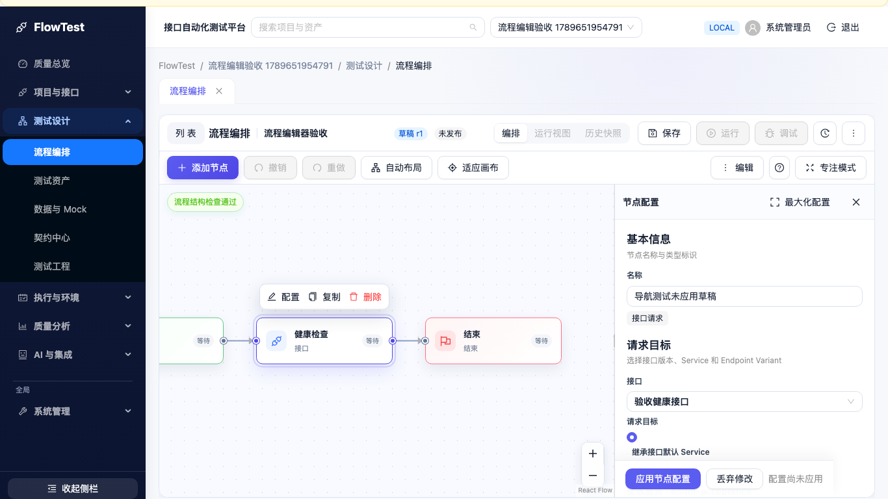
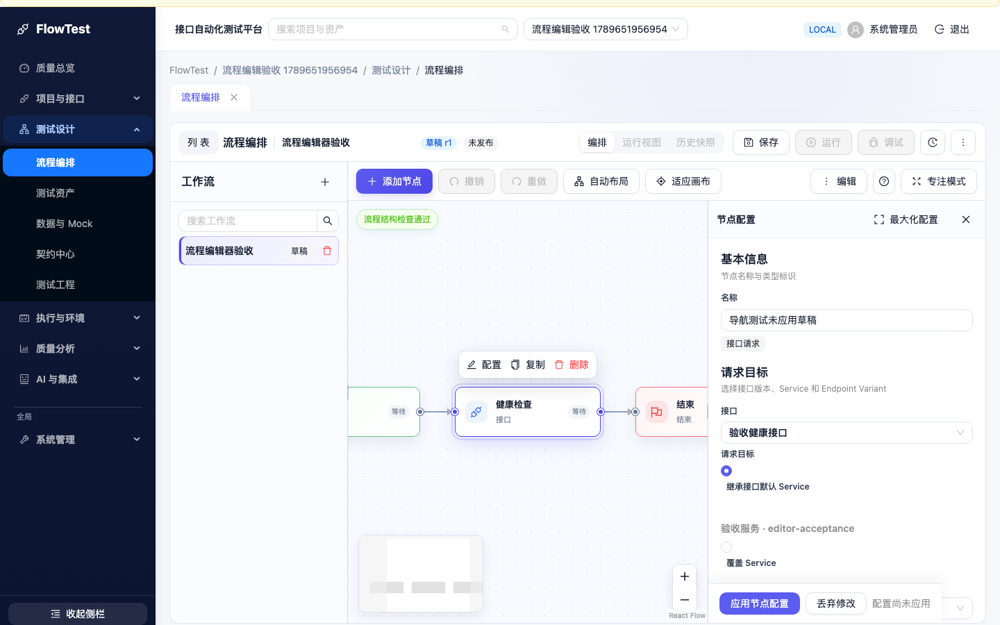
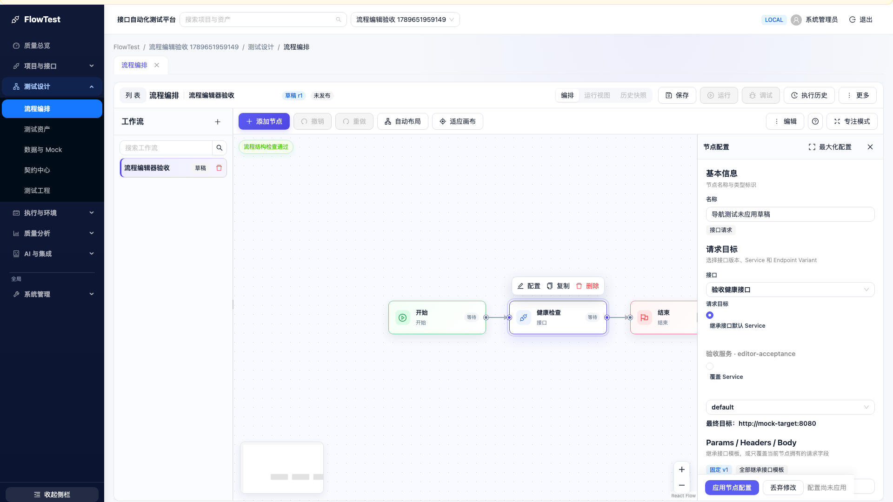
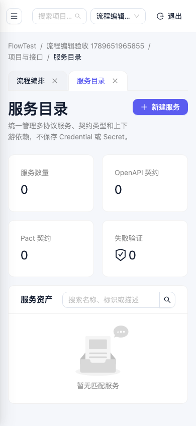

# 二级导航实施与验收

依据用户提供的《FlowTest_二级菜单改造方案》和 HTML 交互原型，在 `d638257` 主干基线上实施。原型仅用于导航交互与视觉参考，生产页仍使用现有业务组件。

## 导航树与旧→新映射

26 个原 section 和页面名称全部保留，管理员看到全部入口，普通用户看到 24 个入口。质量总览与六个分类组成 7 个一级入口；分类采用 Ant Design `children` 子菜单，最多展开一个，不增加三级菜单或新页面。

项目页路径继续为 `/projects/:projectId/:section`。项目选择与历史全局业务路径的重定向继续沿用现有规则。下表全局入口使用固定路径。

| 原 section        | 原页面名称   | 新分类                     | 路径                                            |
| ----------------- | ------------ | -------------------------- | ----------------------------------------------- |
| dashboard         | 质量总览     | 独立一级入口               | /projects/:projectId/dashboard（或 /dashboard） |
| apis              | 接口管理     | 项目与接口                 | /projects/:projectId/apis                       |
| services          | 服务目录     | 项目与接口                 | /projects/:projectId/services                   |
| request-targets   | 请求目标     | 项目与接口                 | /projects/:projectId/request-targets            |
| protocols         | 多协议工作台 | 项目与接口                 | /projects/:projectId/protocols                  |
| settings          | 项目管理     | 项目与接口                 | /projects/:projectId/settings                   |
| workflows         | 流程编排     | 测试设计                   | /projects/:projectId/workflows                  |
| assets            | 测试资产     | 测试设计                   | /projects/:projectId/assets                     |
| data              | 数据与 Mock  | 测试设计                   | /projects/:projectId/data                       |
| contracts         | 契约中心     | 测试设计                   | /projects/:projectId/contracts                  |
| test-engineering  | 测试工程     | 测试设计                   | /projects/:projectId/test-engineering           |
| tasks             | 任务执行     | 执行与环境                 | /projects/:projectId/tasks                      |
| environments      | 环境实验室   | 执行与环境                 | /projects/:projectId/environments               |
| performance       | 性能实验室   | 执行与环境                 | /projects/:projectId/performance                |
| reports           | 测试报告     | 质量分析                   | /projects/:projectId/reports                    |
| impact            | 影响分析     | 质量分析                   | /projects/:projectId/impact                     |
| change-regression | 变更回归     | 质量分析                   | /projects/:projectId/change-regression          |
| quality           | 质量中心     | 质量分析                   | /projects/:projectId/quality                    |
| release           | 发布门禁     | 质量分析                   | /projects/:projectId/release                    |
| ai                | AI 助手      | AI 与集成                  | /projects/:projectId/ai                         |
| contexts          | 上下文检查器 | AI 与集成                  | /projects/:projectId/contexts                   |
| ai-changes        | AI 变更集    | AI 与集成                  | /projects/:projectId/ai-changes                 |
| mcp-changes       | MCP 变更集   | AI 与集成                  | /projects/:projectId/mcp-changes                |
| organization      | 组织治理     | 系统管理（全局）           | /organization                                   |
| fabric            | 分布式执行面 | 系统管理（全局、仅管理员） | /execution-fabric                               |
| platform          | 平台管理     | 系统管理（全局、仅管理员） | /platform                                       |

菜单先过滤叶子权限，再构建分类。组织治理继续向登录用户开放，系统管理分类不会因包含管理员页面而整体隐藏。菜单可见性不替代后端权限检查。

## 交互与状态边界

- 分类 key 使用 `nav:*`，与业务 section 分离。点击分类只控制展开，不触发 Link、WorkspaceTabs 或业务导航。直接打开/刷新深链、切换 Tab、前进后退和项目切换时，由 pathname 同步分类；query/hash 变化不会重置分类。
- 用户主动关闭当前分类后，普通 render 不会立即重新展开。总览没有已存偏好时不展开分类；初次加载恢复合法已存分类；路由优先于过期缓存。
- 展开 224px、收起 72px。收起时使用可点击及键盘操作的子菜单浮层，popup openKeys 与展开状态分离；恢复展开时打开当前页面分类。品牌和底部按钮固定在侧栏内部，菜单独立滚动。
- `<992px` 使用 Drawer；选择叶子、Escape 或遮罩关闭后恢复导航按钮焦点。992–1279px 无偏好时默认收起，≥1280px 默认展开。响应式变化不回写用户桌面折叠偏好。
- 偏好存于 `flowtest:navigation:v1:${userId}`，只接受布尔折叠值及合法分类 key。损坏 JSON、未知 key、浏览器禁止读写均安全降级。角色变化重新同步路由并过滤叶子；用户切换重新初始化侧栏。
- 面包屑：项目页 `FlowTest → 项目 → 分类 → 页面`；全局页 `FlowTest → 系统管理 → 页面`；总览不伪造分类。分类文字不导航。
- 全局 organization/platform/fabric 页选择项目，直接进入新项目 dashboard。业务页选择项目保留 section；清除项目回到 `/dashboard`。`pathFor` 为全局管理页面始终生成全局路径。

DraftSessionProvider 的用户 key、ApplicationRoutes 的项目/全局 key、WorkspaceTabs 的 userId+projectId 存储 key 均保持不变。侧栏状态不进入页面 key；未保存编辑不会因为展开/收起导航而卸载。全局搜索仍搜索项目与资产，不宣称支持菜单搜索。没有后端业务、数据库、脱敏策略或业务编辑器改造。

## 验收方式

表征测试先验证原导航链接与管理员/普通用户入口数量，再抽取共享配置。实现后增加导航状态、偏好、角色切换、项目选择边界单测；旧端到端场景通过真实展开分类后选择叶子，未强制保持隐藏子项可见。

| 验收编号           | 证据                                                                                         |
| ------------------ | -------------------------------------------------------------------------------------------- |
| N01–N02、N04       | navigation-config / App 表征测试：26/24 项、原 label/href、无重复                            |
| N03、N07、N12、N14 | ShellSidebar / navigation-preferences：URL/query/hash、草稿、render、存储损坏/禁止与角色变化 |
| N05–N06、N08       | grouped-navigation 浏览器：深链刷新、Tab/后退、浮层 Enter/选择/Escape                        |
| N09–N11            | ProjectProvider / App：业务 section 保留、项目边界、三类全局页选项目、无项目创建引导         |
| N13                | 既有工作流 focus/proposal 回归及导航 query 保留测试；不改变提案治理                          |
| N15–N16            | grouped-navigation：1366×768、1440×900、1920×1080、1100 默认收起、390 抽屉与焦点恢复         |

本地使用独立 `flowtest-grouped-navigation` Compose 项目、独立数据卷和 13020/18020 端口，加载本分支前端构建与后端代码，未修改原有运行栈。浏览器使用 Chromium；截图数据由测试生成。

### 首轮本地全量检查

- 后端 `uv run --no-sync ruff format --check .`：564 个文件符合格式。
- 后端 `uv run --no-sync ruff check .`：通过。
- 后端 `uv run --no-sync mypy app`：396 个源文件通过。
- 后端 `uv run --no-sync pytest`：1449 passed、7 skipped，覆盖率 90.68%。使用已有依赖环境并指定 `PYTHONPATH=.` 加载本分支代码。
- 前端 `pnpm format:check`、`pnpm lint`、`pnpm build`：通过。
- 前端 `pnpm test:coverage`：88 个测试文件、420 个测试通过；语句 85.70%、分支 80.78%、函数 84.89%、行 87.93%。

- `FLOWTEST_E2E_BASE_URL=http://localhost:13020 pnpm exec playwright test e2e/grouped-navigation.spec.ts --project=chromium`：最终 7 个专项场景及认证 Setup 全部通过（8 passed），其中窄屏额外验证 320px 顶栏控件可达；前期另运行 `--grep 'menu scroll'` 验证 420px 高度下菜单独立滚动、品牌/底部按钮不移动且工作区不滚动（专项及 Setup 2 passed）。涵盖未保存节点输入、编辑器 DOM 实例保留和折叠总览图标的键盘导航。

### 实际页面截图

截图使用测试生成的项目/工作流，不包含公司 Swagger 或真实业务数据。原型的占位内容未进入产品。

### 工作流交互回归

`FLOWTEST_E2E_BASE_URL=http://localhost:13020 pnpm exec playwright test e2e/grouped-navigation.spec.ts e2e/workflow-editor-layout.spec.ts e2e/workflow-editor-interactions.spec.ts --project=chromium --grep-invert 'FORM/LIFE|ACC/FORM/PAL'`：16 passed，包括认证 Setup、6 个导航专项、6 个编辑交互和3 个工作区尺寸检查。路由往返后非法 JSON 请求会话保留、输入焦点保护、拖动与撤销、连线操作、全屏请求还原以及三个尺寸的画布几何检查均通过。

本地本轮没有启动执行 worker，未在此命令重复两项发布/执行场景；完整执行与业务场景由 GitHub Compose CI 验证。不会把未执行的本地场景算作通过。

### 审阅与构建补充

首轮全量统计对应初始菜单实现；复审后 9 个相关测试文件 58 个测试通过，侧栏模式隔离后 7 个组件测试与 8 个专项浏览器场景通过。最终提交的完整门禁记录见 [PR #105](https://github.com/a3384379/FlowTest/pull/105)。

- 总览首次加载恢复合法的展开分类偏好，无偏好仍默认收起。具体业务页路由优先于缓存；从其他页面进入总览仍按路由规则关闭分类。补充了刷新与收起/展开恢复单测。
- Menu 两种模式使用各自实例，隔离 Ant Design 模式切换后的迟到关闭事件。只有导航 Menu 随模式切换，业务页的 React key 和实例保持不变；多尺寸未应用输入/DOM 实例验收继续通过。
- 首轮远程 Compose 在 containerd vendoring 阶段缺少 OpenTelemetry `go.sum` 校验条目，尚未执行浏览器验收。`backend/Dockerfile` 增加 `go mod download all`，补齐既有模块图的校验信息，原 containerd commit、Go 与 gRPC 版本声明保持不变。
- 定向 containerd 构建通过，三个 binary 都通过原 `go version -m` gRPC v1.83.2 校验。本地 Docker Hub 元数据请求未完成，因此验证使用同一 SHA256 digest 的本地已下载 Go 镜像临时别名；提交的 Dockerfile 仍使用原 pinned digest。验证命令 `docker build -f /private/tmp/flowtest-nav-build-definition/Dockerfile --target containerd-builder -t flowtest-nav-containerd-builder backend`。

## 修改文件

- `frontend/src/App.tsx`、`App.test.tsx`：接入侧栏与分类面包屑，更新原导航表征测试。
- `frontend/src/features/navigation/navigation-config.tsx`、`navigation-config.test.tsx`：26 项共享标签、6 类、过滤与原路径。
- `frontend/src/features/navigation/ShellSidebar.tsx`、`ShellSidebar.test.tsx`：桌面折叠/浮层、移动 Drawer、行/图标/键盘导航。
- `frontend/src/features/navigation/use-navigation-state.ts`：路由同步、单分类、响应式与独立 popup 状态。
- `frontend/src/features/navigation/navigation-preferences.ts`、`navigation-preferences.test.ts`：用户隔离及安全降级。
- `frontend/src/features/projects/project-routing.ts`、`ProjectProvider.tsx`、`ProjectProvider.test.tsx`：全局页选择项目和 `pathFor` 边界。
- `frontend/src/styles.css`：固定品牌/底栏、独立滚动、窄屏顶栏与 Drawer 配色。
- `frontend/e2e/grouped-navigation.spec.ts`、`support/navigation.ts`：真实父/叶菜单路径与多尺寸验收。
- `frontend/e2e/s14-management-workbench.spec.ts`、`s15-test-assets.spec.ts`、`s17-data-mock.spec.ts`、`s18-contract-automation.spec.ts`、`s19-quality-scale.spec.ts`、`s21-ai-review.spec.ts`、`s22-capability-sdk.spec.ts`、`s29-execution-fabric.spec.ts`、`s30-failure-intelligence.spec.ts`、`s31-release-gate.spec.ts`、`v1-acceptance.spec.ts`、`workflow-editor-interactions.spec.ts`：按可见父分类选择原页面。
- `backend/Dockerfile`：必要的 containerd 构建校验信息补齐，独立构建修复提交。
- 本文与 `docs/navigation/navigation-{1366,1440,1920,mobile}.png`：旧→新映射与实际页面证据。

## 已知边界

本次支持键盘与 Chromium 验收，不代表所有浏览器或真实安装环境已验收。编辑器窄屏内部布局继续遵循原阈值，不新增移动端业务编辑模式。菜单偏好存储不可用时只在内存中保持当前会话；无偏好下按照屏宽恢复。权限、项目草稿与提案的 Review/Apply/Publish/Execute 生命周期继续由现有业务规则控制。
