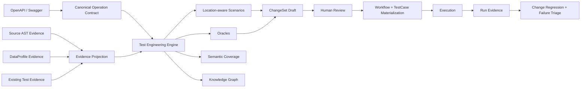

# FlowTest V5 S47.1 语义正确性与证据闭环

状态：本地功能与隔离 Compose 门禁完成，等待远程/外部证据（2026-08-23，Asia/Shanghai）

本轮审计起点为 `codex/v5.0@96c629045f19a112e3bdad78a82d3ebc2119aa59`；
开始开发时实际 HEAD 已包含系统使用文档提交 `c1c85332af4b4ebfbb8396718420ef44913d87ac`。
迁移 head 从 `20260823_0041` 前进到 `20260823_0042`。本文只把实际接通并有测试证据的
能力记为完成；远程 CI、Windows 实机、连续 RC、安全审批和真实 Key Rotation 均不在本地证据内。

## 1. 审计发现

| 能力 | 审计时真实实现 | 已确认缺口 | 优先级 | 本轮落点 |
|---|---|---|---|---|
| OpenAPI Contract Persistence | APIVersion 主要保存可执行示例 | Schema、响应与约束在导入后丢失 | P0 | `canonical_contract` 快照与 0042 backfill |
| Canonical Operation Contract | Request 是无位置 JSON Schema | Path/Query/Header/Cookie/Body/Auth 混合 | P0 | 带 location 的参数、请求体、认证和响应模型 |
| Parameter Location | Scenario 只有字段路径 | Query/Header/Auth 可被错误写入 Body | P0 | `ScenarioRequest`、location mutation 和 request override |
| Evidence Fusion | Evidence 可检查但主要作为引用展示 | 未明确改变场景、覆盖和图谱 | P0 | Evidence Projection、冲突和逐 Finding provenance |
| Scenario Materialization | 主要物化 Body 与 Status | auth missing、Path、Query、Header 和 Schema Oracle 不闭环 | P0 | 安全认证覆盖、位置物化和 Assert 节点 |
| FlowSpec API Version | 导出移除实例版本 | pinned/current 语义丢失 | P0 | Fingerprint v3 与 Operation Version Mapping |
| Change Semantic Coverage | 资产 Mapping gap 驱动草案 | Mapping=covered 时语义 gap 被跳过 | P0 | 资产覆盖与测试语义覆盖独立计算 |
| Source Evidence Redaction | 主要按敏感字段名过滤 | 中性字段可携带 Secret/PII | P0 | 递归 value sanitizer 与 Enum 哈希摘要 |
| Failure Triage | 所有收到的 5xx 偏向 Endpoint Failure | 503 与 Service identity 不准确 | P0 | upstream 分类、contract 优先级、service key |
| Migration Truthfulness | 0041 downgrade 可把 planned 写成 migrated | 制造虚假密钥迁移事实 | P0 | 未发布 0041 的 downgrade 校正 |
| Pairwise / State | 简化组合；include_state 无实质输出 | 能力名称和开关真实性不足 | P1 | State 显式 unavailable；Pairwise 仍列剩余风险 |

`20260823_0041` 不存在于 `origin/main`，因此本轮只校正尚未进入主线的 downgrade，未改写
已发布 migration。S47 已正确实现的 Service Target、Workflow Engine、Execution Engine、
ChangeSet、组织权限和 MCP Application Service 边界均被复用，没有创建平行系统。

## 2. Canonical Contract Schema

每个 Operation Contract 现在显式保存：

- `operation`、`method`、`path`、`service`、`source_ref`、`revision`、`completeness`；
- `parameters[]` 的 `name/location/required/schema/style/explode/source_ref`；
- `request_body` 的 `required/content_type/schema`；
- `responses[status]` 的 `description/content_type/schema`；
- `auth` 的 `required/kind/location/name/source_ref`；
- 对规范化 JSON 计算的 SHA-256 `contract_fingerprint`。

OpenAPI 3 与 Swagger 2 导入保留 required、nullable、type、enum、number/string/array 边界、
pattern、format、uniqueItems、additionalProperties、response status/schema。只解析文档内本地
`$ref`，不会抓取或执行外部引用。参数 example 不进入权威契约；可执行示例仍属于既有 API
Version 请求配置，但不能冒充 Schema。

## 3. API Version Contract Persistence

`api_versions` 新增：

| 列 | 语义 |
|---|---|
| `canonical_contract` | 当前版本不可变的权威或 partial Operation 快照 |
| `contract_fingerprint` | 规范化契约 SHA-256 |
| `contract_completeness` | `complete`、`partial` 或 `legacy_partial` |

导入新版本时快照写入对应 APIVersion，不会被后续 current version 覆盖。手工 API 只根据字段
类型构造 partial contract，不保存 Header/Query 的值。PostgreSQL 0042 和 Standalone SQLite
都会为旧 APIVersion 生成安全 partial contract：保留可证明的字段名、位置、推断类型和认证类型，
不伪造 response status，也不复制 Header/Query 值。

## 4. Evidence Fusion

DataProfile 的 nullable、enum、unique、foreign key、min/max/length 会投影为字段约束、重复值、
不存在引用和边界候选；Python AST 的 route、enum、validation 和 error branch 会投影为 Operation
关系、候选值、约束和错误路径。只有实际参与推导的 Finding 才进入 Scenario/Oracle/Coverage 的
`evidence_refs`。Contract 与 Source/DataProfile 约束冲突时保留双方证据，场景变为
`deterministic=false`、`requires_review=true`，默认禁止直接物化。

REST Proposal v2 冻结规范化 Evidence Bundle、每个 Bundle 指纹、generation policy、完整契约、
契约/设计指纹、API version、环境和 endpoint variant；Apply 会重新验证并重新生成设计，证据或
目标发生变化即阻断。额外证据最多 10 个 Bundle，每个 Bundle 仍受自身预算控制，聚合输入不超过
2 MiB。MCP `inspect_source_evidence` / `inspect_data_profile` 的 Bundle 可直接传给
`generate_test_design.additional_evidence`。

Knowledge Graph 消费 Operation、Service、Request/Response Schema、Data Entity、FK、Workflow 和
Source Dependency。`include_state=true` 在没有明确状态证据时返回 capability unavailable、warning
和 review requirement，不再静默忽略。

## 5. Parameter Location 与 Scenario

`ScenarioMutation.location` 支持 `path/query/header/cookie/body/auth`。生成器分别处理：

- Path：必填、format、type 和边界；
- Query：省略、类型、enum、format 和边界；
- Header/Cookie：必填省略、类型、格式和约束；
- Body：嵌套 required、数值/字符串/数组边界、enum、type 和 additionalProperties；
- Auth：inherit 与 missing；missing 使用节点级 `auth_disabled`，不删除 Secret、不写空 Token。

Happy Path 递归构造嵌套 object 和 array item，满足嵌套 required。无法可靠生成 pattern 合法值时
不伪造确定性数据；冲突或不确定场景保持 design-only/review。

## 6. Materialization Matrix

| 语义 | Workflow 落点 | 执行行为 |
|---|---|---|
| Path set | Workflow variables / path template | 替换对应 Path Variable |
| Query set/omit | `request_overrides.query_parameters` | 写入或移除 Query |
| Header set/omit | `request_overrides.headers` + `replace_headers` | 写入或明确移除 Header |
| Cookie set/omit | Cookie request override | 按 Cookie 位置发送或移除 |
| JSON Body | `request_overrides.body` | 保持嵌套 JSON 结构 |
| Auth inherit | 默认节点行为 | 继续解析 API 定义的 Secret Ref |
| Auth missing | `auth_disabled=true` | 跳过定义级 Authorization/API Key/Cookie |
| Auth invalid | 显式安全测试 Secret Ref | 没有 Ref 时保持 design-only |

Snapshot 只保存认证模式、service key、variant、revision 和安全 origin，不保存 Secret 或原始凭据。
Header override 会在解析 API 定义级 Header 模板之前进入 RequestTargetResolver；因此 omitted 场景不会
先解析一个即将被替换的 `{{Header-Variable}}`，也不会因无关的未解析变量阻断执行。
真实 runtime 负面测试会将位置变更发送到 Mock Target，并验证实际 Path、Query、Header、Body 和
Authorization absence，而不是只检查 Workflow JSON。

## 7. Oracle Materialization

唯一确定的 2xx、非法输入 4xx 和认证 401/403 会物化为 Status Assert。非法输入状态优先使用明确
400；没有 400 但只有一个非认证 4xx 时使用该真实状态（例如 422）。响应 Schema 使用
`jsonschema` 的真实 Assert 节点；支持的 JSON Path 和 expression 比较也生成 Assert。Database、
State Transition、Cross-API Consistency 或缺少唯一确定状态的 Oracle 会返回 blocker/design-only，
不会被静默丢弃，也不会默认伪造 200。

## 8. FlowSpec Version Strategy

Schema 仍为 `flowtest-flow-spec-v1`，新导出使用
`flowtest-flow-spec-fingerprint-v3`：

- 节点显式 `api_version` → `version_strategy=pinned`；
- 节点未显式版本 → `version_strategy=current`；
- 两者都记录 export 时的 `source_version` 和 `contract_fingerprint`；
- pinned 导入必须通过显式 version mapping 或 exact fingerprint 找到兼容版本；找不到即 blocker；
- current 落地时不写 `api_version`，继续跟随目标 current；pinned 恢复目标 exact version；
- version strategy 和 contract fingerprint 都参与 v3 指纹。

S47.1 阶段曾保留 v1/v2 原投影读取，并以 Source current v3 / node pinned v1 → Target current v4 /
mapped compatible v1 验证版本固定语义。S47.2 已明确 V5 只正式支持 fingerprint v3；上述开发期
旧投影代码可以保留，但不构成兼容承诺、迁移范围或合并门槛。v3 中 pinned 目标没有 exact compatible
version 时仍必须阻断，禁止回退 current。

## 9. Semantic Coverage 与 Change Regression

资产 Mapping Coverage 只决定变更关联了哪些 TestCase/Workflow；Test Semantic Coverage 从
TestDesign.scenarios、TestCase→Workflow、request overrides、path variables、expected status 和
Assert 语义中提取。无法理解的旧 Workflow 记为 unknown，绝不默认 covered。
审核物化后的 TestDesign 只保存用户实际选择的 Scenario 及其对应 Oracle；未选中的生成候选不会再被
误算为既有测试覆盖。

Change Regression 现在独立遍历可测试的 OpenAPI 结构化变更，即使资产 Mapping 已是 100% 也会
检查语义 gap。`maximum 100 → 999` 且旧覆盖包含 99/100/101 时，只生成新合法边界 999 和新非法
边界 1000；100 不重复生成，101 作为当前合法历史 adjacent 解释。Oracle 来自当前 APIVersion
Canonical Contract。接受草案时可传 API/环境/Variant/Scenario，复用 TestEngineering 的审核物化
服务生成 TestDesign + Workflow + TestCase bundle；不自动加入正式 TestPlan，也不自动执行。

## 10. Source Evidence Redaction

递归 value sanitizer 识别 Bearer、Basic、JWT、PEM、AWS key pattern、高熵 API key、email、phone、
card、URI userinfo 和 URL query/fragment secret。Source Enum 只返回短、低风险标量；一旦包含
敏感或长值，输出 `value_count/value_hashes/values_redacted`，不返回原值。Repository URL 禁止
userinfo、query 和 fragment。`EvidenceFinding.sensitive=true` 时 structured data 已被替换为摘要，
TestEngineering 不使用原值生成数据，MCP/Audit/TestDesign 均不返回原值。

## 11. Failure Triage Rules

| 信号 | Primary 规则 |
|---|---|
| DNS/TLS/Connection Refused、无 response | Network；同 service 多节点并结合 endpoint health 可聚合为 Service Endpoint |
| 收到 HTTP 5xx | `UPSTREAM_SERVICE_FAILURE` |
| 5xx + contract/schema assertion | `CONTRACT_DRIFT` 优先 |
| 5xx + 明确产品断言 | Product Defect candidate |
| 401/403 | Auth Failure |
| retry 后通过 | Flaky |

Execution Observation 现在携带安全的 `service_key`、`endpoint_variant`、endpoint revision/safe origin；
Failure Triage 优先使用 service key，不再只从 URL hostname 推断 service，也不返回 query/userinfo。

## 12. Migration 与运行档位

- Revision：`20260823_0042`，down revision `20260823_0041`；
- PostgreSQL：新增 3 列和 fingerprint 索引，安全 backfill legacy APIVersion；downgrade 删除这些列；
- 0041 truth fix：downgrade 不再把 `active + planned` 写为 `migrated`；
- SQLite：baseline head 更新为 0042，增量升级创建列、索引并执行同语义的安全 partial backfill；
- Transfer：Manifest 版本仍为 `standalone-compact-transfer-v1`，schema revision 更新为 0042；
- Key Rotation：仍只有 planned 元数据，真实重加密/验证/回滚未完成，继续作为 GA blocker。

真实 PostgreSQL 已验证 `0040 → 0041 → 0042 → 0041 → 0042`、`alembic current/check`、列查询和
0041 downgrade 的 key lifecycle truth；完整最终命令结果在本轮交付报告记录。

## 13. Frontend

Test Engineering 页面显示 contract completeness/fingerprint、parameter location、Evidence Conflict、
materializable/design-only reason、Oracle materialization 和 State unavailable；Scenario 表展示 location、
path、mutation、expected category 和 evidence。FlowSpec Review 显示 pinned/current、source/target version、
contract fingerprint 和 mapping blocker。Change Regression 显示资产/语义覆盖摘要；Failure Triage 继续
显示 service key、variant、主次分类、证据和建议。

## 14. CI 与测试门禁

Compose CI 的 S47 job 已升级为 S47.1 semantic/negative/MCP/pinned gate，仍由 pull request 和 main
触发，不依赖临时 codex 分支名。Smoke 真实执行 Body 999/1000、Query、Path、Header omission、
Missing Auth、Response Schema、多 Service FlowSpec、Pinned Version、MCP Generate/Dry Run、Reviewed
Proposal Materialization 和 Change Regression 999/1000 Proposal。

本地门禁结果：Backend `456 passed / 3 skipped`、总覆盖率 `90.01%`；Frontend `211 passed`，
Statements `86.17%`、Branches `80.07%`、Functions `85.36%`、Lines `88.32%`，Build 通过；
Standalone schema/transfer `22 passed`；真实 PostgreSQL migration current/check 与 3 个 Contract
列查询通过；隔离 Compose S47.1 smoke 通过并真实执行 6 个负面/边界 Workflow；Playwright against
Compose `2 passed`。`pip-audit` 未发现已知漏洞（本地项目包不在 PyPI，按工具输出跳过）。

远程 GitHub CI 在推送后如未形成/完成 workflow run，必须记为 `NOT RUN`，不能用本地结果替代。

## 15. Remaining Risks

- P0：本地代码链路无已知未关闭 P0；外部证据不计为代码 P0 完成。
- P1：当前 pairwise 仍是有界代表组合/成对候选，尚未输出完整 value-partition covering array 的
  未覆盖 pair gap；显式 State Model 尚未实现，能力保持 unavailable。
- P2：Source Provider 当前只支持有界 Python AST；DataProfile 是安全的 typed input，不代表任意生产
  数据库连接器已经获得审批。
- External：Remote CI、Windows x64 公司云桌面试点、Standalone/Compact 长时 Live Runtime、连续 RC、
  安全审批、真实备份恢复和真实 Key Rotation 仍需外部执行与签署。

## 16. 发布判定边界

S47.1 的本地语义闭环完成后，只能进入
`READY_FOR_V5_FUNCTIONAL_COMPLETION_REVIEW`。由于真实 Key Rotation 和外部/时间型门槛未完成，
`GA_READY` 必须保持 `NO`；本文不构成 Merge、Tag、Release 或生产发布授权。

## 17. S47.2 后续校正

S47.2 进一步关闭了 S47.1 尚存的安全与正确性缺口：Canonical Contract 从“字段级脱敏”收紧为统一
allowlist sanitizer；0043 对既有 PostgreSQL/Standalone 数据执行同语义净化并重算 fingerprint；请求
suppression 在全部配置层合并后应用；Coverage 绑定 Operation 和 location；Change Regression 使用
当前契约支持 Body/Path/Query/Header/Cookie；Evidence 区分规范性约束与观察统计并执行对称冲突；
exclusiveMinimum/exclusiveMaximum 与 Source AST 严格比较保持精确边界。

同时校正文档范围：V5 正式 FlowSpec 基线仅为 fingerprint v3，开发期 v1/v2 不属于正式兼容承诺，
S47.2 不为旧格式增加迁移复杂度。最终事实与测试结果见
[S47.2 最终正确性与安全闭环](s47-2-final-correctness-security.md)。本文原有外部证据和 GA 限制继续
有效；真实 Key Rotation 等门槛未完成，因此 `GA_READY` 仍为 `NO`。

## S47.3 后续语义校正

S47.1 的 Value/Category 覆盖结论已被 S47.3 的 Oracle Set Fingerprint Token 收紧；Current TestPlan Gap
已从建议升级为硬门禁。最终事实见 [S47.3 记录](s47-3-final-semantic-integrity.md)。

## S47.4 后续评审校正

S47.3 后复审确认 Coverage 还必须包含 API Version 和 Contract Fingerprint，Workflow Assert
还必须证明执行图必达。最终实现、0045 迁移、E2E 顺序隔离和当前 PR 证据见
[S47.4 记录](s47-4-final-review-fix.md)。本文不单独授权 Merge、Tag 或 Release。
