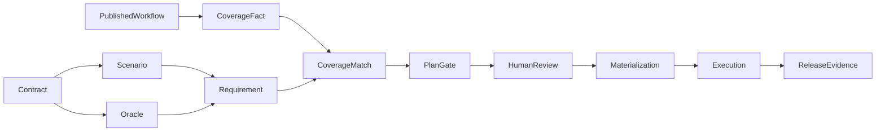

# FlowTest V5 S47.3 最终语义完整性闭环

状态：候选实现与验证记录（2026-08-24，Asia/Shanghai）

本文记录 `S47.3 — V5 Final Semantic Integrity Closure`。它只关闭最终语义一致性、
安全边界、发布门禁和合并审查问题，不新增 V5 大功能，不处理开发期 FlowSpec v1/v2 兼容。

## 1. Baseline

- Branch：`codex/v5.0`
- Reviewed SHA：`61d2fc8d9d45e293ed6a38c073224e3b24322418`
- Migration Before：`20260823_0043`
- Migration After：`20260823_0044`
- Draft PR：[#40](https://github.com/a3384379/FlowTest/pull/40)
- 开始时本地与远程分支指向同一 SHA，独立 Worktree 干净。

## 2. Confirmed Findings

Phase 0 重新确认了九个提示缺口：Coverage Token 未比较 Oracle；Current Plan Gap 不阻断；
多 Service 同路由不唯一；Materialization 不复验冻结身份；AST Compare 不理解控制流；
Canonical Keyword 缺少值类型/范围校验；敏感 Enum 保存无盐 Hash；`multipleOf` 相邻值使用
float；Migration 依赖可变运行时 Sanitizer。Compose 验收还发现一个关联缺口：
Importer 内部的 `{{parameter}}` 路径与 Diff 的 `{parameter}` 键未归一，使当前 Contract
Fingerprint 元数据丢失。该缺口已用路径键归一和回归测试关闭。

## 3. Oracle Semantic Identity

Oracle 身份不使用数据库 ID、显示名或实例 UUID：

- Status：`status:<code>`；明确多状态使用集合语义。
- Response Schema：`schema:<semantic-schema-fingerprint>`，不包含 annotation、source、warning 或敏感明文。
- JSON Path/Expression：`<kind>:<expression>|<operator>|<canonical-expected>`。
- Oracle Set：对确定性身份去重排序后使用 SHA-256，得到 `oracle_set_fingerprint`。

只有 Category 已知、至少一个可追溯确定性 Oracle、无 Review/Conflict 且集合指纹非空时，
Coverage Fact 才是 complete。

## 4. Semantic Coverage Token

```text
semantic_value|expected_category|oracle_set_fingerprint
```

覆盖匹配同时比较 Operation、Location、Field 和 Token。因此 `400→422`、`200→201` 或
Response Schema 变更都是 `NOT COVERED`；只有 Value、Category、Status、Schema 精确一致才是
`COVERED`。无确定性 Oracle 时是 `PARTIAL/UNKNOWN`。

## 5. Current TestPlan Gate

Selection Summary 分离 `asset_mapping_gap_count`、`project_semantic_gap_count`、
`current_test_plan_semantic_gap_count`、`waived_current_plan_gap_count` 和
`unresolved_current_plan_gap_count`。保留的 `semantic_gap_count` 只映射 Project Known 缺失的变更组数。

Current Plan 存在未解决缺口时，Approve/Execute 返回 409
`CHANGE_REGRESSION_PLAN_GAP_UNRESOLVED`，Release Gate 返回 `blocked`。三个阶段均重新计算。
显式 Add-to-Plan 仅接受当前项目、Impact Selected Scope 内且能精确覆盖 Gap 的资产，去重、
写 Audit、重算 Coverage，不自动执行。

## 6. Waiver Policy

`SemanticGapWaiver` 按 Run + Gap 持久化，包含 Reason、Approver、Approval Time、可选 Expiry、
Operation Identity、Semantic Requirement 和 Requirement Fingerprint。每个 Gap 单独 Waive；只允许人工
User，Service Token 返回 403。Operation/Contract/Requirement 改变或过期后旧 Waiver 无效。
Waiver 写 Audit 和 Release Evidence，状态是 `WAIVED`，不是 `COVERED`。

## 7. Operation Identity

Change Item 携带 portable ref、service key、method、normalized path、current/baseline fingerprint 和 run ID。
Operation 按显式 API/Version、Impact Selected Published Asset、当前 Fingerprint、Service+Route、portable ref、
唯一 Route 的顺序解析。无法唯一时保持 Review Blocker，不选第一个。Draft 和未进 Impact
Scope 的 Workflow 不参与反解。

## 8. Materialization Binding

ChangeSet Snapshot 冻结 API Definition ID、Version、Service、Method、Path、portable ref 和 Fingerprint。
物化前对全部字段复验：错误 API/Service/Route 返回 409 `CHANGE_REGRESSION_TARGET_MISMATCH`，
Version/Fingerprint 变化返回 409 `CHANGE_REGRESSION_TARGET_STALE`，且不创建 Workflow/TestCase。

## 9. AST Control Flow

Python AST 只在 Assert、明确 Validator Return Predicate、Guard+Raise 和 Validator Guard+Return False
中生成 `deterministic=true, confidence=1`。Guard 条件逻辑反转；常量在左侧时交换操作符。
`if A or B: raise` 可分解；`if A and B: raise` 保留 `complex-guard` 且 requires review。
普通业务分支只是 `supporting-condition`，不进入 Boundary Oracle。

## 10. Constraint Satisfiability

Evidence 合并后校验数值上下界、独占边界、Enum 类型和 Enum 边界。不可满足约束生成
`constraint_unsatisfiable`，不生成 Happy Path，并阻断 Materialization。

## 11. Canonical Schema Validation

`CanonicalSchemaValidator` 执行 Key Allowlist、Value Type/Range、Sensitive Value 和 Complexity Budget。
`type`、numeric/length/count、`required`、`properties`、`items`、combinator、`additionalProperties`、
`enum`、`format`、`pattern` 和 `discriminator` 都有明确限制。非法新导入返回 422
`CANONICAL_CONTRACT_INVALID`，只包含安全的 path/keyword/reason。未知 Format 只作 Annotation；
不安全 Pattern 进 Review，不使用无界 Regex 阻塞生成。

## 12. Sensitive Enum Policy

敏感 Enum 不保存明文或无盐 Hash，只保存：

```json
{"value_count": 2, "values_redacted": true}
```

REST、MCP、Audit、Test Design 和 Migration 均不输出原值或 Hash。

## 13. MultipleOf Algorithm

边界算法使用 `Decimal(str(value))`，不使用二进制 float 取整。
`exclusiveMaximum=1.05, multipleOf=0.1` 的最大合法值是 `1.0`；`minimum=0.3` 是 `0.3`；
`exclusiveMinimum=0.3` 的最小合法值是 `0.4`。输出无浮点噪声，整数仍输出整数。

## 14. Migration 0044

0044 不改写 0043。它创建 `semantic_gap_waivers`，清理历史非法 Keyword、删除敏感 Enum Hash、
调整 Completeness 并重算 Fingerprint。Migration 只依赖标记为
`Migration contract: immutable after release` 的 `app.migrations_support.canonical_contract_v2`，不导入运行时 Domain。
Downgrade 只删除 Waiver Schema，不恢复敏感值、Hash 或非法 Keyword。Standalone、Transfer 和
Windows Bundle Head 同步为 0044。

## 15. Local Tests and Remote CI

本地最终验证：

- Backend：Ruff Format/Check、Mypy（324 files）、Import Linter 通过；`560 passed, 3 skipped`，Coverage `90.01%`。
- Frontend：Format、Lint、214 个测试、Coverage Gate 和 Build 通过；Statements `86.19%`、
  Branches `80.12%`、Functions `85.36%`、Lines `88.39%`。
- Migration：真实 PostgreSQL 17.6 完成 `0043→0044→0043→0044`，敏感 Hash 不恢复、
  Fingerprint 稳定；容器内 `alembic current` 为 `20260823_0044 (head)`。
- Compose：独立 Project/Port/Volume 中 `scripts/smoke_s47.py` 通过，并已 `down --volumes`。
- Playwright：登录 Setup `1 passed`。在 S47 Smoke 之后额外执行的非 S29 全量中，
  S14 旧项目 Secret 表单没有发出 PUT，随后执行已中止；该非 CI 顺序结果记为失败，
  不伪装为通过。Remote Compose CI 使用标准顺序（浏览器验收先于 S47 Smoke）做合并判据。

Golden 覆盖 Oracle Status/Schema、无 Oracle、Plan Gate、Add-to-Plan、Waiver/过期/Service Token、
错误物化目标、多 Service 歧义、AST 控制流、不可满足约束、严格 Canonical Keyword、
Enum Hash 清理和 Decimal MultipleOf。Remote Actions 必须对应最终 HEAD；未完成或失败时
`MERGE_TO_MAIN: NO-GO`。本文所在提交不追加二次“CI 结果提交”，最终 Run ID 和 URL 在交付报告记录。

## 16. Remaining Risks

- Pairwise：Bounded；State Model：Unavailable/Experimental；Knowledge Graph：Basic。
- Key Rotation：Planned Metadata Only，没有真实 Apply/Re-encrypt/Verify/Rollback。
- FlowSpec v1/v2：Development-only / Unsupported Compatibility；V5 正式指纹基线仍是 v3。
- Windows 实机、长时 Standalone/Compact、连续 RC 观察、安全审批和人工签署未完成。

## 17. Release Decision

最终判定只在最终 HEAD 的本地和 Remote CI 全部验证后回填。无论本轮结果如何：

```text
GA_READY: NO
```

本文不授权自动 Merge、Tag、Release，PR #40 保持 Draft，必须经人工最终审查。

## 18. Architecture


