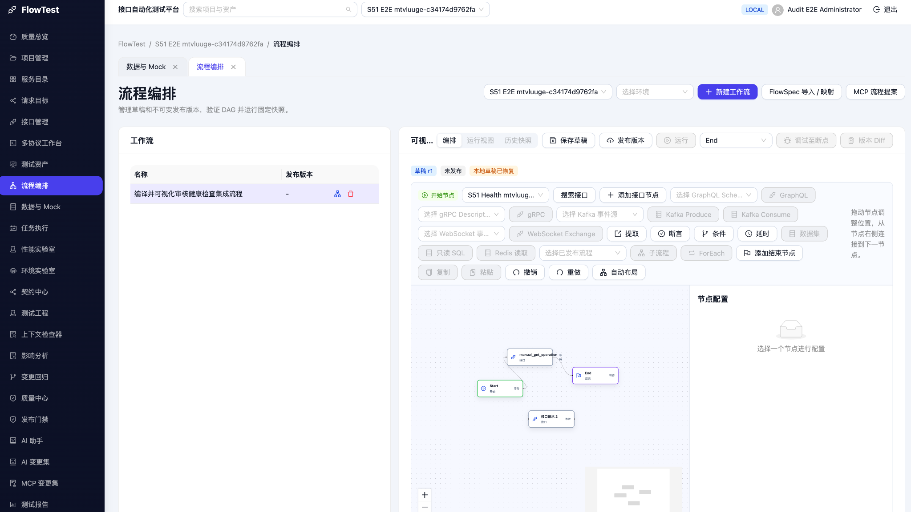
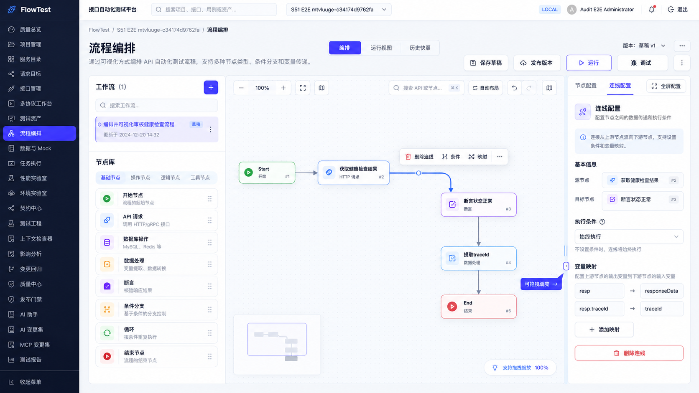
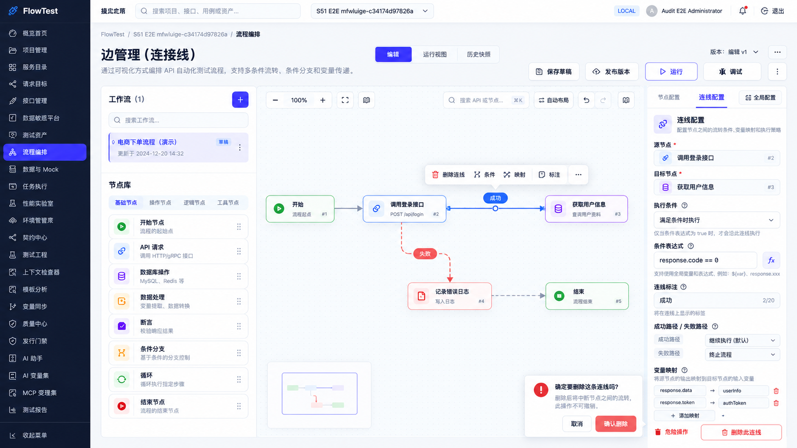

# FlowTest 流程编排专项优化：源码校准版代码级实施方案

> **状态：开发规格，不是已完成实现或测试报告。**  
> **规格版本：1.0 · 2026-09-13**  
> **源码基线：`a3384379/FlowTest` / `main` / `b445786a0441d3b87b77cc95ce250ad99d9b36a7`。**  
> 该提交是 PR #99 的合并提交。本文不再把前轮 `4469cc6` 或 `db4ae1f` 当作当前分支 HEAD。  
> 本次只读取源码、已有方案和截图，并生成文档；没有修改仓库，没有安装依赖、编译、运行单测、启动服务或调用真实被测业务接口。

## 0. 如何使用这份规格

这不是“再画一个好看的流程页面”，也不是要求 Codex 重写 FlowTest。目标是把用户提出的五个问题变成可以按文件实施、用测试验证、不会破坏既有工作流的改造。

**实施依据优先级固定为：本文件 →《源码校准与偏差修正清单》→《Codex_分阶段执行任务书》→《回归验收矩阵》→ UI 图 → `reference/` 中旧方案。** 任务书与矩阵不得改变本文契约；如发现矛盾，先修正规格，不擅自取舍。

UI 图只确定布局和视觉方向。图中的任意连线表达式、通知节点、不可撤销删除、暂停后下游仍运行、Tab 快速新增、可编辑节点 ID 等内容，**均不是可以直接实现的后端功能定义**。

所有新文件名、新类型和函数签名是本文提出的目标结构；不是声称这些符号已存在。代码块分为“目标接口”和“参考实现片段”，Codex 必须完成导入、实际类型对齐和测试，不得将片段当作已经编译通过的完整补丁。

### 0.1 必须先读的配套文件

| 文件 | 作用 |
|---|---|
| `source-baseline.json` | 固定提交、20 个已核对文件的 blob SHA、读取范围；避免误判“已提交/未提交” |
| `源码校准与偏差修正清单.md` | 旧方案和 UI 图逐项纠偏，记录本次静态校准结果 |
| `Codex_分阶段执行任务书.md` | T00–T11 的输入、修改范围、退出门槛、禁止操作 |
| `回归验收矩阵.md` | 测试编号、层次、前置、操作、断言、阻断规则 |
| `fixtures/README.md` | 脱离真实业务环境的 JSON 测试样例及适用边界 |

### 0.2 不能省略的工程规则

遵守仓库 `AGENTS.md`：英文标识符、中文用户文案、显式类型、单函数圈复杂度不超过 10；先补 characterization tests 再重构；实际需要三处复用后再提炼通用抽象。不要改成另一个前端框架，不升级依赖，不引入图编辑器或新的全局状态库。[^S01][^S02]

自动脱敏继续 **OFF by default**，遵守现有项目/安装策略，不新增扫描、替换、屏蔽业务字段，也不扩大日志采集。UI 交互、画布坐标、撤销历史不能成为新增收集请求正文或凭据的理由。[^S01]

本文只规划开发。执行本计划时，单测可使用合成数据；E2E 仅针对明确授权的隔离环境。编辑、打开配置、自动布局、保存草稿不应自动调用被测业务接口。

---

## 1. 原始目标与验收对象

| 需求 ID | 用户问题 | 必须交付的行为 | 不合格的替代实现 |
|---|---|---|---|
| R01 | 配置固定大小 | 右栏调宽、请求配置抽屉调宽、节点配置最大化；布局变化不丢输入 | 只把 420px 改成 600px；用浏览器缩放代替 |
| R02 | 按钮太多、不知用途 | 单一“添加节点”入口；常用/高级分类；用途与不可用原因 | 原有按钮换图标后继续全部平铺 |
| R03 | 连线找不到删除入口 | 线可选中；浮动菜单、右栏、Delete 共用同一删除命令；可撤销 | 只加一个按钮，键盘和内部删除仍走其他路径 |
| R04 | 画布快捷键 | 焦点限定 Delete、复制、粘贴、撤销、重做、配置、定位；输入框不受影响 | window 全局监听 Delete；鼠标悬停即抢占键盘 |
| R05 | 整体 UI 重设计 | 画布优先、紧凑工作流列表、分组工具栏、独立滚动、专注模式 | 生成独立静态演示页，不接现有数据和事件 |
| R06 | 原有目标不被改坏 | API 固定版本、请求覆盖、字段映射、主/清理阶段、MCP 提案兼容 | 重建 JSON 丢掉高级字段、修改后端 schema 迁就 UI |
| R07 | Codex 实现可控 | 每阶段可编译、可回归；差异有登记；失败不得继续下一阶段 | 一次性修改几十个文件，最后才发现数据模型不合 |

**最低完整交付范围是 R01–R07 全部完成。** 不要求同时上线实时单步调试、任意连线表达式、图形版本 Diff、通用脚本节点、多人协作或新的执行引擎。

---

## 2. 源码核查结论：不要把“缺 UI”误认为“缺全部能力”

### 2.1 关键文件的真实职责

| 来源 | 真实文件/符号 | 已有能力 | 本次处理 |
|---|---|---|---|
| S03 | `pages/WorkflowsPage.tsx`：`WorkflowWorkspace`、`DraftActions`、`DraftEditor` | 页面壳、草稿/运行/历史视图、导入提案、页签和执行结果 | 调整布局与操作分组，不丢弃原组件和路由参数 |
| S04 | `flow/WorkflowDesigner.tsx`：`WorkflowDesignerReady` | React Flow 适配、选中节点、工具栏、50 条左右快照历史 | 收敛为编辑协调层，拆出图适配和命令 |
| S05 | `WorkflowNodeInspector.tsx`：`ApiFields`、`MappingFields`、`JsonConfig` | 各类型节点配置、入站映射、Service/Endpoint 选择 | 保留语义、引入编辑会话与明确校验 |
| S06 | `WorkflowApiRequestEditor.tsx`：`RequestEditor`、`requestOverrides`、`buildOverrides` | Params/Headers/Body 继承或覆盖、版本固定、请求预览 | 保留扩展字段；抽屉可调宽/最大化；修正预览边界 |
| S07 | `workflow-graph.ts` | 添加节点、连接、单节点粘贴、层级布局 | 保留工厂，增加上下文、校验、原子编辑 helper |
| S08 | `features/workflows/use-workflows.ts` | 草稿内存与本地存储、保存并发保护、运行/历史结果 | 保留 `baseRevision/editVersion/generation`；不要另造草稿 store |
| S09 | `workflow-service.ts` | 工作流 CRUD、发布、运行、断点前运行、重放、版本差异 | 尽量复用，仅做兼容性参数扩展 |
| S10 | `workflow-draft-store.ts` | 按服务实例/用户/项目/工作流隔离本地草稿 | 原格式不迁移；布局偏好另存 |
| S11 | `api-console/api-service.ts` | API 分页搜索、按 ID/版本获取、模板请求预览 | 复用；不要扫描整个项目全部 API |
| S12–14 | 前端 `lib/api.ts`；后端 `engine/contracts.py`、`schemas/workflows.py` | 严格定义、节点配置、边映射和 DAG 校验 | 前端补齐已有字段类型，不放宽后端 |
| S15–16 | `styles.css`、`App.tsx` | 固定画布尺寸、应用壳与项目页签 | 限定工作区样式，不能重写其他页面 |
| S17–18 | `WorkflowDesigner.test.tsx`、`playwright.config.ts` | 已有复制/布局/撤销等测试、Compose E2E 入口 | 增量扩充真实浏览器交互，不以 mock 代替全部验收 |

### 2.2 已从源码确认的问题

**B01：选择事件处理不完整。** `applyCanvasNodeChanges` 只接纳 `position`；`applyCanvasEdgeChanges` 只接纳 `remove`。`selectedId` 只表示一个节点，`toCanvasNode/toCanvasEdge` 也没有完整回传受控选择态。因此仅增加 `onEdgeClick` 不等于选择、框选、Delete 已完整工作。[^S04]

**B02：删除路径不统一。** 节点删除按钮通过 `removeNode` 删除节点及相邻边；画布节点 remove 事件却未被接纳。React Flow 默认键位与业务删除保护没有统一。必须明确关闭其默认删除入口，由业务命令统一执行，不能两套逻辑叠加。[^S04][^L01]

**B03：声明可以重连，但没有业务重连闭环。** React Flow 设置了 `edgesReconnectable={canvasEditable}`，却未接入 `onReconnect`。即使补该事件，也必须同步处理 `mappings.source/target.node_id`，不能只改 SVG 端点。[^S04][^S13]

**B04：拖动可能生成过细历史并同步写本地存储。** 每次有效位置变化会经过 `applyChange`，后者复制完整定义并调用父层 `onChange`；`setDraftDefinition` 又写入 localStorage。当前未见“拖动开始—预览—结束提交”事务。这里是静态调用链判断，不是已测量的性能指标。[^S04][^S08]

**B05：尺寸限制真实存在。** `.workflow-designer-body` 使用 `minmax(540px, 1fr) 420px`，画布 `height: 540px`；请求配置使用 `Drawer size="large"`。单改宽度常量不能解决多栏挤压和全屏表单保留。[^S06][^S15]

**B06：默认来源节点不符合用户意图。** `defaultNodeConfig` 使用 `definition.nodes.at(-1)?.id`；线性流程最后通常是 End，新建提取/断言可能默认指向 End，而不是用户刚选中的 API。已有测试甚至把来源为 End 固定为预期，应针对新行为修正，不能照旧测试保留该体验问题。[^S07][^S17]

**B07：字段映射仍存在线上业务定义的边里。** `MappingFields` 从入站边读取；点击添加默认取第一条入站边。节点右栏和新连线右栏必须编辑同一 `edge.mappings`，不能再创建 `node.config.mappings`。[^S05][^S12][^S13]

**B08：请求覆盖重建存在字段丢失路径。** `requestOverrides` 只读三类字段，`buildOverrides` 也只返回三类字段，保存时整个覆盖对象被替换。后端已有 `replace_headers`、`auth_disabled/auth_mode`、三类 `suppressed_*`；这些字段可能由 MCP/其他入口生成。只修改 Body 不应让负向认证测试重新带认证。[^S06][^S13]

**B09：前后端部分类型不对齐。** 后端已有 `WorkflowDefinition.runtime_inputs` 与 `MappingTransformKind.JSON_PARSE`，本次读取的前端对应类型尚未声明。必须补齐既有类型，并验证编辑往返不丢字段；不能用 `any` 解决。[^S12][^S13]

**B10：本地草稿与服务端草稿约束不同。** localStorage 草稿可以保存编辑中的图；服务端 `WorkflowDraftUpdate.definition` 使用严格 `WorkflowDefinition`，要求主流程可达、至少一个 End、条件节点恰好 true/false 两条出边等。断开一条线后可能无法保存到服务端，这是既有契约，不是改造后可以忽略的异常。[^S10][^S13][^S14]

**B11：部分 JSON 输入静默失败。** `JsonConfig` 的失焦解析失败时返回 undefined、不更新，也未给出明确错误。全屏配置应保留无效文本并显示字段错误，不能看起来已经保存。[^S05]

**B12：预览不等于节点实际最终请求。** 现有调用未传入 API preview 已支持的 `serviceOverride/endpointVariant`，也没有传完整图的上游上下文和扩展覆盖语义。至少补两项已支持参数；不能把模板预览改个标题继续声称“真实最终请求”。[^S06][^S11]

**B13：调试与 Diff 的 UI 图超出了当前页面服务契约。** 页面调用的是断点前运行及节点重放；版本 Diff 为两个发布版本的 path/before/after 列表。不能据图声称已有可暂停的调试会话、resume/step 或任意草稿图形比较。[^S08][^S09][^S14]

**B14：只读应由多层共同保证。** 当前主要依赖上游传入 `editable`；`isCanvasEditable` 本身只结合 edit/proposal。新控制器必须再次结合 `runtimeMode`，不能因某个复用页面传错 editable 就让历史图可写。[^S04]

**检查范围说明：** 这些结论基于列出的源码段和相同 blob 的前轮读取，不代表整个仓库已全面审计。没有实机重现的行为在文中按“调用链风险/应验证”处理。

---

## 3. 固定设计决策：先消除自由发挥空间

| 决策 | 必须实现 | 必须拒绝 |
|---|---|---|
| D01 图引擎 | 继续 `@xyflow/react` 12.x，按 lockfile 实际类型实现 | 替换为另一个流程库或独立 HTML 演示页 |
| D02 UI | 保留 React 19 + Ant Design 6；优先原生 Splitter/Drawer 能力 | 增加另一个 UI 体系或第三方拖拽分栏包 |
| D03 数据 | `WorkflowDefinition` 是持久化领域定义，父层草稿仍是唯一权威 | 将 React Flow `Node/Edge` 直接存入后端 |
| D04 临时状态 | 选择、viewport、尺寸、悬浮菜单、拖动预览只存在编辑器 UI 层 | 把 `selected/width/dragging/sourceHandle/style` 写入定义 |
| D05 连线 | 普通边 condition=null；条件节点边 true/false；规则在条件节点配置 | 任意边表达式、新增 success/failure 值、任意标签字段 |
| D06 删除 | 单一业务命令；支持撤销；提示影响 | 文案“不可撤销”；为了删除绕过引用校验 |
| D07 快捷键 | 画布焦点范围；Tab 保留原生导航；Shift+A 添加节点 | 全局监听、鼠标悬停抢焦点、Tab 默认弹新增 |
| D08 只读 | runtime/history/proposal 可以看、选择、缩放，不可改定义 | 只禁用表单，却允许快捷键、重连或布局写入 |
| D09 复杂表单 | 同一表单实例调宽/最大化；有未保存修改时关闭要确认 | 两套 Drawer/Modal 切换导致卸载、重置输入 |
| D10 草稿 | 沿用 expected_revision；本地未完成图明确状态 | 后端关闭 DAG 校验、自动发布未保存内容 |
| D11 新功能 | 本次 UI/编辑闭环；旧执行能力原样复用 | 顺带实现新执行引擎、通用代码节点、实时调试 |
| D12 呈现 | 原图只是参考；中文和状态以规格为准 | 逐像素抄图中的错字、错误日期和伪能力 |

**依赖注意：** `package.json` 声明了 `@xyflow/react:^12.11.2`、`antd:^6.5.4`、`react:^19.2.8`、`pnpm@11.16.0`。这是声明范围，不是本文已解析的最终安装版本。T00 必须检查 `pnpm-lock.yaml` 与实际类型文件。[^S02]

---

## 4. 目标文件结构与逐文件修改边界

不要求一次建完下面所有文件。按任务书的依赖顺序创建；不能创建一堆占位组件并宣称完成。

```text
frontend/src/flow/
  WorkflowDesigner.tsx                  # 保留公开入口；协调编辑状态和现有调用方
  WorkflowDesigner.test.tsx             # 保留既有测试，拆出测试按需追加
  WorkflowCanvas.tsx                    # 新增：纯画布/视口和事件适配
  WorkflowCanvas.test.tsx
  WorkflowEditorToolbar.tsx             # 新增：常用操作，不放协议下拉列表
  WorkflowNodeLibrary.tsx               # 新增：统一添加节点面板
  WorkflowNodeLibrary.test.tsx
  WorkflowEdgeInspector.tsx             # 新增：真实边配置
  WorkflowEdgeInspector.test.tsx
  WorkflowInspectorShell.tsx            # 新增：右栏/最大化容器，内容不重建
  WorkflowShortcutHelp.tsx              # 新增：快捷键说明
  WorkflowNodeInspector.tsx             # 修改：复用已有类型字段与编辑会话
  WorkflowApiRequestEditor.tsx          # 修改：覆盖保留、调宽/最大化、关闭保护
  WorkflowApiRequestEditor.test.tsx
  WorkflowRunInspector.tsx              # 保留，必要时适配新布局
  workflow-graph.ts                     # 修改：工厂上下文、原子连接/删除/布局
  workflow-editor.css                  # 新增：仅工作区与嵌入式适配，不污染全站
  editor/
    editor-types.ts                     # 新增：UI 状态、命令、结果
    graph-analysis.ts                   # 新增：effective type、拓扑/引用诊断
    graph-commands.ts                   # 新增：纯领域编辑操作
    graph-commands.test.ts
    canvas-adapter.ts                   # 新增：领域定义 -> React Flow，仅单向适配
    editor-history.ts                   # 新增：纯历史栈/事务逻辑
    editor-history.test.ts
    use-workflow-editor.ts              # 新增：控制器；副作用在事件层
    use-node-edit-session.ts             # 新增：事务式表单及会话内存恢复
    use-canvas-hotkeys.ts               # 新增：局部焦点与键盘命令
    use-workspace-layout.ts             # 新增：尺寸、折叠、专注模式及偏好
    node-registry.ts                    # 新增：有限的已支持节点目录
    request-overrides.ts                # 新增：类型化覆盖编辑与保留逻辑
```

| 文件 | 本次具体责任 | 不允许顺便改动 |
|---|---|---|
| `WorkflowsPage.tsx` | 工作流列表折叠；工作区高度；核心按钮分组；传递 editor identity/surface；继续展示原结果/历史 | 删除 FlowDialogs、RepairDialog、页签关闭保护；换掉 URL `focus/proposal` |
| `WorkflowDesigner.tsx` | 移出工具栏/画布/纯 helper；接统一命令；保留 proposal props、runtime props 和默认参数 | 新增网络请求去保存另一个草稿；删除旧 props 导致提案页面报错 |
| `WorkflowNodeInspector.tsx` | 提取可复用表单 body；API mapping 入口共用边命令；JSON 错误可见；引用 ID 只读 | 把所有 config 转成新的 schema；将 Capability 配置写进 config |
| `WorkflowApiRequestEditor.tsx` | 保留非当前 UI 管辖字段；表单会话、抽屉尺寸和关闭校验；已有预览参数对齐 | 调用 API 模板写接口；默认更改认证或 API 版本 |
| `use-workflows.ts` | 新命令仍调用 setDraftDefinition；增加只读保护；必要时显式执行版本；改善文案 | 删除 editVersion/generation/rebase 逻辑；改草稿持久化 key |
| `workflow-service.ts` | 运行可选显式 version 参数；其余路径复用 | Invent `/edges`、`/nodes` CRUD 或 `/debug/step` |
| `lib/api.ts` | 补 `runtime_inputs` 和 `json_parse` 等已存在的后端类型 | `as any` 或把所有配置改为任意字典 |
| `styles.css` | 删除/限定旧 workflow 固定尺寸规则；避免旧规则覆盖新文件 | 全局 `body{overflow:hidden}`、重置所有 `.ant-card` |
| `draft-session.ts` / `DraftSessionProvider.tsx` | 类型化保留节点未应用输入，复用离页保护；必要时精确调整文案 | 新建全局 store；只登记 unsafe 不保留输入；覆盖既有 unsafe key |
| 后端 contracts/schemas | 本次只作权威参考与回归 oracle | 为 UI 便利放宽 extra、连通性、条件分支或阶段隔离 |

**公开兼容契约：** `WorkflowDesigner` 增加可选的 `surface?: 'embedded' | 'workspace'`，默认 `embedded`；`WorkflowsPage` 显式传 workspace。现有提案对话框继续嵌入式，不继承固定定位/全屏/大面积 viewport 样式。

---

## 5. 数据与状态架构

### 5.1 唯一持久化链路

```text
用户交互
  -> 焦点/模式守卫
  -> EditorCommand
  -> 基于最新 WorkflowDefinition 计算 nextDefinition
  -> 一次历史事务
  -> onChange(nextDefinition)
  -> useWorkflows.setDraftDefinition
  -> memoryDrafts + existing local draft store
  -> 用户显式保存 -> updateWorkflowDraft(expected_revision)
```

不能让按钮直接 `apiClient.patch`、快捷键只改 React Flow store、右栏另外修改 Zustand、撤销又写第三份 JSON。以上全部绕过统一命令的方式都不接受。

### 5.2 状态归属表

| 数据 | 所在层 | 持久化 | 修改方式 |
|---|---|---|---|
| definition | 现有 useWorkflows 草稿层 | 现有本地草稿和服务端 | 统一提交回调 |
| selection | 编辑控制器 | 否 | select changes / 点击 / 菜单 |
| 临时拖动 positions | 编辑控制器 | 否 | drag preview；拖动结束才提交 |
| 表单原始文本/dirty/errors | 当前编辑会话 | 不另存真实请求副本 | 表单内部；Apply 成功后写领域图 |
| history past/future | 编辑控制器 | 否 | 领域事务；默认上限 50 |
| viewport | React Flow 实例 + UI 偏好 | 可选，只存坐标/缩放 | 手势与视口按钮，不进历史 |
| 左右栏尺寸/折叠 | layout hook | 独立 UI 偏好 | 尺寸变更结束保存 |
| runtimeNodes/context | 原运行状态层 | 不新增存储 | 现有轮询/SSE，不进草稿 |
| baseRevision/editVersion/generation | 现有草稿层 | 保持既有策略 | 不由图组件修改 |

### 5.3 UI 类型（目标接口）

```ts
import type { WorkflowDefinition, WorkflowEdge, WorkflowNode } from '../../lib/api'

export type EditorSelection = {
  nodeIds: readonly string[]
  edgeIds: readonly string[]
  primary: { kind: 'node' | 'edge'; id: string } | null
}

export type EditorIdentity = {
  serverInstance: string
  userId: string
  projectId: string
  workflowId: string
  surface: 'workspace' | 'embedded'
}

export type EditDiagnostic = {
  code: string
  severity: 'error' | 'warning'
  message: string
  nodeId?: string
  edgeId?: string
  path?: string
}

export type GraphEditResult =
  | { kind: 'unchanged' }
  | { kind: 'blocked'; diagnostics: readonly EditDiagnostic[] }
  | {
      kind: 'changed'
      definition: WorkflowDefinition
      selection?: EditorSelection
      diagnostics: readonly EditDiagnostic[]
    }

export type NodePositionUpdate = {
  id: string
  position: WorkflowNode['position']
}

export type EditorCommand =
  | { type: 'delete-selection'; selection: EditorSelection }
  | { type: 'move-nodes'; positions: readonly NodePositionUpdate[] }
  | { type: 'replace-node'; expected: WorkflowNode; replacement: WorkflowNode }
  | { type: 'replace-edge'; expected: WorkflowEdge; replacement: WorkflowEdge }
  | { type: 'auto-layout' }
  | { type: 'undo' }
  | { type: 'redo' }
```

连接、重连、添加节点命令应使用下文的具名参数类型，不把 React Flow 的事件对象放入命令或历史。删除确认另用 `DeletionPlan`，不能将“用户已确认”缓存为全局布尔值。

### 5.4 不进入服务端的数据

`selected`、`dragging`、`measured`、`width/height`、`style`、`ariaLabel`、`sourceHandle/targetHandle`、`inspectorWidth`、`fullscreen`、`viewport`、`clipboard`、`history`、UI mapping row key，一律不得成为新的 `WorkflowDefinition` JSON 字段。

后端多个模型 `extra='forbid'`，新增这些字段不仅污染模型，也可能导致 422。[^S13]

---

## 6. React Flow 事件接线：逐项约定

### 6.1 CanvasAdapter 的单向职责

`canvas-adapter.ts` 输出只用于显示的节点与边：

```ts
function toCanvasNode(
  node: WorkflowNode,
  selection: EditorSelection,
  transientPosition?: WorkflowNode['position'],
): CanvasNode

function toCanvasEdge(
  edge: WorkflowEdge,
  selection: EditorSelection,
  sourceKind: WorkflowNode['type'],
): CanvasEdge
```

在真实实现中继续合并原有 `statuses/proposalNodeStatuses/proposalEdgeStatuses/runtimeLabel`。选择高亮使用单独 outline/边粗细，不能覆盖 passed/failed/added/removed 的状态含义。

**selection 可视状态必须回传 `selected`；不是只有业务对象存在 selectedId。** 尺寸测量可以保存在 CanvasNode UI 层，但不可写回 definition。

### 6.2 事件到处理器的固定映射

| React Flow/DOM 事件 | 处理函数责任 | 是否提交 definition |
|---|---|---|
| `onNodesChange` 的 select | 更新 selection.nodeIds，合并本批事件 | 否 |
| `onEdgesChange` 的 select | 更新 selection.edgeIds | 否 |
| node/edge click | 设置 primary 并打开对应 Inspector；不与多选处理互相清空 | 否 |
| `onPaneClick` | 清空选择、关闭上下文菜单 | 否 |
| node position / dragging | 更新 transientPositions，按帧渲染 | 否；结束时例外 |
| `onNodeDragStart/onSelectionDragStart` | 保存事务起点和涉及 ID | 否 |
| `onNodeDragStop/onSelectionDragStop` | 用最终坐标一次 move-nodes；清除预览 | 是，一次 |
| `onConnect` | 正常连线业务校验 -> append edge | 是，一次 |
| `onReconnect` | 下文的重连事务；同端点为 no-op | 是，确认通过才一次 |
| `onNodeContextMenu/onEdgeContextMenu` | 设置当前目标；菜单坐标做边界限制 | 否 |
| 内建 remove | 不作为主删除通路；默认键盘删除关闭 | 不直接提交 |
| onMove/zoom/fitView | UI viewport | 否 |
| `onInit` | 保存 ReactFlowInstance，允许工具栏操纵视口 | 否 |

**唯一选择权威是 editor selection。** `onSelectionChange` 可用于辅助诊断/展示，但不得再建立第二套 selection store。建议直接处理两类 Change 中的 select，node click 只更新 primary。否则框选后 onNodeClick 会把多选意外缩成一个。

### 6.3 明确 React Flow 默认行为

传入 `deleteKeyCode={null}`，关闭默认 Backspace 删除；业务热键支持 Delete 和 Backspace（Mac 的 Delete 常表现为 Backspace）。所有破坏性操作都走 command dispatcher。保留键盘可访问性；不要通过 `disableKeyboardA11y=true` 粗暴关闭整个图键盘能力。[^L01]

`nodesDraggable/nodesConnectable/edgesReconnectable` 根据 canMutateGraph 设置。只读下仍允许元素选择、焦点、查看配置、平移和缩放。

源端多 Handle 采用仅 UI 的派生规则：普通节点 `out`；条件节点 `true` / `false`。`sourceHandle` 只从 `edge.condition` 推导，不新增持久化字段。历史无分支标签的非法条件图显示问题，不自动猜测并保存。

### 6.4 统一写守卫

```ts
const canMutateGraph = editable && mode === 'edit' && runtimeMode === undefined
```

`editable` 必须由调用方包含现有项目写权限判断，不应只根据是否处于 draft 计算；权限尚未确认时不开放写操作。现有角色/系统管理员例外以仓库实际授权逻辑为准，不另造角色表。服务端授权仍是最终边界。再叠加正在关闭/应用外部替换等短暂事务锁。每一个命令入口都检查它，不只检查按钮 disabled。可读操作与可写操作分离：历史模式可以复制可见文本、查节点，不可粘贴或自动布局后写回定义。

---

## 7. 删除节点与连线：原子事务和影响检查

### 7.1 目标接口

```ts
export type DeletionPlan = {
  deleteNodeIds: readonly string[]
  deleteEdgeIds: readonly string[]
  protectedNodeIds: readonly string[]
  mappingCount: number
  references: readonly EditDiagnostic[]
  requiresConfirmation: boolean
}

function planDeletion(
  definition: WorkflowDefinition,
  selection: EditorSelection,
): DeletionPlan

function applyDeletion(
  definition: WorkflowDefinition,
  plan: DeletionPlan,
): GraphEditResult
```

`planDeletion` 是只读分析，不创建时间戳、随机 ID，不发送网络请求。`applyDeletion` 不弹 Modal，只返回结果。

### 7.2 删除计算顺序

1. 基于当前 definition 筛选真实存在的 selection ID；空目标返回 unchanged。
2. 主流程的 effective START 不可删除；同时保护唯一的主流程 END。
3. 计算选中可删除节点，计算所有入边/出边，与显式选中边取并集。
4. 检查**仍然保留的节点**是否通过显式引用指向要删除节点。
5. 有硬引用则阻断此次删除，定位引用方；不擅自清空配置，也不一并删除所有下游节点。
6. 统计映射行数；有映射、条件边、多个被删节点或显式多选边时显示影响确认。普通单线无映射时直接删除并显示未完成诊断和撤销；不额外为同一动作连续弹两次确认。
7. 用户确认后重新基于最新定义计算计划；目标变化则要求重新确认，不能用旧完整 JSON 覆盖新图。
8. 一次性过滤 nodes 和 edges；一次进入历史；一次 onChange；清理无效 selection。

可删除一个普通节点及关联边后让图暂时处于本地未完成状态。禁止自动 A→B 绕过被删的中间节点：该节点可能是断言/鉴权/清理逻辑，自动直连会改变测试目的。

### 7.3 需要检查的引用位置

| 位置 | 处理 |
|---|---|
| `config.source_node_id` | 保留节点引用被删目标：阻断，给出定位 |
| `config.expected_source_node_id` | 同上，保留动态断言 |
| legacy-equivalent capability 的 `configuration` 对应字段 | 按 effective kind 检查，不假设 type 一定是 legacy |
| `cleanup_for[]` | 保留清理节点引用被删主节点：阻断或要求先修改清理范围；默认阻断 |
| `edge.mappings[*].source/target.node_id` | 随同相邻边删除；任何残留边端点异常报告错误 |
| `bindings[*].expression`、含节点引用的模板字符串 | 不能做全局字符串替换；已识别明确引用则提示/阻断，无法完整解析明确标为静态分析未覆盖 |

静态检查不等于运行时证明。不要把 `unknown expression` 悄悄当作“无依赖”。结构删除对不支持分析的 Capability 使用保守确认或阻断，并保留原始配置供用户处理。

### 7.4 删除连线的 UI

选中线后：线高亮、显示方向；浮动条提供“配置连线 / 删除连线”；右栏给出源、目标、分支、映射数和“删除连线”。右键菜单也调用同一 action。

确认文案：**“将删除 1 条连线及其 2 条字段映射，可能使流程暂时不完整。删除后可撤销。”**

删除后反馈：**“已删除连线 · 撤销”**。不带映射的普通单线可直接删除并提供撤销。任何入口都不能出现“不可撤销”。

### 7.5 必须满足的后置条件

`definition` 原对象不被修改；不存在残留的未知边端点；有保护节点的多选只删除允许项并提示跳过；引用阻断时不产生历史；无变化时不写草稿；撤销恢复同一个 edge ID、condition、全部 mappings，而不是重新创建一条空线。

---

## 8. 连线创建、分支、重连与映射绑定

### 8.1 连线校验分两层

**交互层强校验：** 源/目标存在、非自环、不能进 Start/出 End、不能跨 main/cleanup、不能成环、条件 Handle 合法、同一条件分支不能重复。非法连接给出可读原因。

**完整图校验：** 条件节点是否已具备 true/false 两边、所有 main 节点是否可从 Start 到达且能到 End、数据集数量等；允许编辑中暂时不完整，保存到服务端前检查。[^S13]

环检测使用 adjacency + DFS/Kahn，复杂度应为 O(V+E)，禁止每次拖动都请求后端或执行真实接口。重连检测时先从候选图移除原 edge，再验证新连接，否则会把旧边当作重复边或环。

### 8.2 连接参数与 ID

```ts
type GraphConnectionInput = {
  sourceId: string
  targetId: string
  branch: 'true' | 'false' | null
  edgeId: string   // 由事件层生成，再交给纯函数
}
```

不再拼接两个最长可 128 字符的 node ID 形成 edge ID；后端 edge.id 也限长 128。由事件层使用 `edge-${crypto.randomUUID()}`，纯函数通过依赖传入 ID 方便测试。连线 ID 在重连时保持不变。

条件两分支可以指向同一目标，若服务端允许则不能被通用 source-target 去重误拦。前端去重规则区分 `(source,target,condition)`；普通完全重复边仍拒绝。不要盲目依赖 `addEdge` 去重规则定义业务语义。

### 8.3 重连闭环

| 情况 | 必须行为 |
|---|---|
| source/target/branch 完全未变 | unchanged，不进历史 |
| 无映射、合法改端点 | 保留 edge ID，更新端点和必要分支，一次提交 |
| 有映射、任一端点变化 | 弹确认，说明字段可能失效；用户可取消或选择“保留路径并重新绑定端点” |
| 用户确认保留映射 | 更新每条 mapping.source.node_id/target.node_id；原 source.path、transform、target.location/key 不变；标记需检查 |
| 无法适配的目标节点 | 不开放 request-specific mapping 编辑；提示类型不兼容；不得伪装已正确映射 |
| 从条件源改为普通源 | condition 置 null，提示原分支含义变化 |
| 改成另一个条件源 | 必须明确 true/false Handle，检查占用；不能“先来先得”重标已有分支 |
| 松手到空白处 | 保留原连线，不隐式删除 |
| 校验失败/取消 | 原图不变、不写历史 |

不要 `delete(oldEdge); add(newEdge)` 两次提交：会丢 ID/映射并产生中间错误状态。不能先落库再弹确认。

### 8.4 条件修改位置

连线 Inspector 显示“普通连接”或“条件为真/为假”；复杂比较配置仍位于 **Condition 节点** 的 `source_node_id/expression/operator/expected`。

若两条 true/false 分支均存在，提供“交换真假分支”，一次事务互换两条 condition。禁止把其中一条直接改成另一条已占用的值后产生重复分支。

### 8.5 同图中的字段传递

边上的 source path 是当前项目既有 JMESPath 语义，不改成 JSONPath；`target.location` 保留 query/header/body/variable。绘图中 `resp.traceId -> traceId` 只是展示，不可直接当作任意节点上下文的真实结构。

每一条 Mapping 必须满足：

```text
mapping.source.node_id == edge.source
mapping.target.node_id == edge.target
```

在“节点入站映射”里新增映射时，必须先明确选择入站边，多入边不可总取第一条。两个 Inspector 复用同一行编辑组件/同一领域更新函数；UI 行 key 存于会话，不添加到持久化 mapping。

---

## 9. 历史与事务：一次操作对应一次撤销

### 9.1 保留快照策略，但停止逐帧快照

本次沿用完整 definition 快照，降低迁移复杂度，不引入复杂 patch engine。默认历史上限 50，与现有实现量级一致；只保存在当前工作流编辑会话内。切换工作流/项目、进入另一运行/历史会话时可清空历史，**但不能清空已有草稿**。刷新后恢复草稿、不恢复撤销历史，需明确为本期边界。

### 9.2 历史对象

```ts
type HistoryEntry = {
  label: string
  before: WorkflowDefinition
  after: WorkflowDefinition
  selectionBefore: EditorSelection
  selectionAfter: EditorSelection
}
type EditorHistory = { past: readonly HistoryEntry[]; future: readonly HistoryEntry[] }
```

整个 definition（含 `runtime_inputs/run_policy/cleanup/configuration/bindings`）都要保留。不得为了“精简历史”只复制 nodes/edges。

### 9.3 事务粒度表

| 操作 | 历史条数 | 草稿写入 |
|---|---:|---:|
| 单击节点/选中边/框选 | 0 | 0 |
| 拖动节点 50 次位置事件后松手 | 1 | 1 |
| 拖动多节点形成一个移动事务 | 1 | 1 |
| 调整右栏宽度、进入/退出专注 | 0 | 0 |
| 添加节点、删除单线、删除多选 | 各 1 | 各 1 |
| 表单输入多个字符后“应用配置” | 1 | 1 |
| 格式错误、取消表单、删除被阻断 | 0 | 0 |
| 自动布局导致位置真正变化 | 1 | 1 |
| 自动布局前后相同 | 0 | 0 |
| undo/redo | 移动既有历史项，不新增重复项 | 各 1 |

### 9.4 控制器实施约束

`use-workflow-editor` 保留最新已提交定义 ref、历史 ref 和用于渲染的 UI state；父层传入 definition 仍是权威。事件处理器计算 next，再更新 ref、history，最后调用一次 onChange。**不得把 onChange、localStorage 或 toast 放进 setState updater/reducer 内**，防止 StrictMode 重复执行副作用。

本地提交的父层 echo：深度内容相同则只确认同步，不再入历史或重置历史。外部导入/恢复/重新加载的定义不同于最后一次本地提交：取消未完成拖动、关闭过期菜单；清空不适用历史并显示“流程已从外部更新”。服务端保存成功只改变 revision、定义内容未变，不应清空历史。

不能只比较对象引用：React Query 可能返回新对象但内容相同。也不能对已有对象排序后直接改写作为比较。比较函数应仅针对 JSON 值、无副作用；无需引入 hash 网络服务。

### 9.5 拖动事务

开始记录选中 ID 与初始位置；中途将位置写入 `transientPositions`；adapter 合并显示。松手将**最终节点坐标**合成一次 `move-nodes`，不依赖可能滞后的 React state。

Esc/失焦/模式切换：取消预览恢复起点，不提交。方向键移动（React Flow a11y）在缺少 dragStart 时须单独提交；按键连续移动可合并为一次 keydown–keyup 事务。不可因为重构只照顾鼠标而令键盘移动失效。

父层定义在拖动中外部替换时直接取消拖动，不将旧坐标叠加到新导入图。

---

## 10. 键盘操作：焦点、输入和弹层的完整边界

### 10.1 明确不是 hover 驱动

点击画布空白、节点或边后编辑器获得焦点。鼠标停在画布上但正在另一个输入框输入，Delete 仍然只删除文字。

画布容器使用 `tabIndex={0}`、可读 aria-label、`:focus-visible` 焦点描边。不得每次 render 自动 focus，也不得阻断 Tab 离开画布。

### 10.2 第一版固定键位

| 快捷键 | 行为 | 作用范围 |
|---|---|---|
| Delete / Backspace | 删除当前选中节点/边 | 画布可写且有选中 |
| Ctrl/Cmd+C | 复制单个可复制节点到当前编辑器内存剪贴板 | 画布；文本输入不拦截 |
| Ctrl/Cmd+V | 粘贴该节点，生成新 ID | 画布可写；无内部剪贴板不吞事件 |
| Ctrl/Cmd+Z | 撤销领域事务 | 画布可写；输入框使用原生文本撤销 |
| Ctrl/Cmd+Shift+Z；Windows Ctrl+Y | 重做 | 同上 |
| Ctrl/Cmd+A | 选择当前画布全部可见节点/边 | 仅画布，不选择整页文本 |
| Enter | 打开 primary 节点/边配置 | 画布，且 primary 单一明确 |
| Shift+A | 打开添加节点 | 画布可写 |
| Space 按住 + 拖动 | 平移 | 画布焦点；不影响输入空格 |
| F | 切换应用内专注模式 | 画布；不是强制浏览器 F11 |
| Esc | 按下述层级关闭/取消 | 最上层有效目标 |
| Tab / Shift+Tab | 原生焦点导航 | 不改写 |
| ? | 快捷键帮助 | 画布，不在输入/输入法组合中 |

单节点复制是本期必需闭环，保持当前能力并修复体验。多选复制/跨流程复制不是本期发布条件；多选时复制按钮明确不可用并解释“当前支持单节点复制”，**不能悄悄只复制第一个**。多选删除/移动仍应支持。

### 10.3 热键守卫检查顺序

1. `event.defaultPrevented` 则返回。
2. `event.isComposing` 或输入法组合状态则返回；不要破坏中文输入。
3. 使用 DOM `composedPath()`/`event.target` 判断真实焦点是否在当前画布；React Portal 的合成事件冒泡不代表属于画布。
4. 任一 input/textarea/select/contenteditable、role=textbox/combobox、Monaco/CodeMirror 编辑区域、原生选择弹层命中则返回。
5. 正在编辑配置/确认删除/API 选择等顶层弹层时，不执行画布命令。
6. 判断命令可用性（模式、权限、选择、history、clipboard）。
7. 仅在确实接管当前命令时 `preventDefault`；每次按键只执行一个命令。
8. 删除/打开配置等破坏性或弹层动作忽略 repeat；方向连续移动单独处理。

### 10.4 Esc 层级

`最上层确认框/选择弹层 -> 节点配置会话（dirty 需确认） -> 右键菜单 -> 连线/拖动预览 -> 清空选择 -> 退出专注模式`。

一次 Esc 只处理一层。关闭有未保存内容的表单不能直接丢弃；继续操作/丢弃由用户选择。

### 10.5 不要注册两个删除监听器

React Flow 默认删除已设为 null。删除按钮、右键、快捷键、可访问操作菜单均调用 `requestDelete(selection)`；内部根据 DeletionPlan 确认，再 commit。

工具栏按钮有完整 `aria-label` 和 `title`，不能把实现质量建立在“用户知道图标”上。

---

## 11. 节点复制、定位、拖拽新增与自动布局

### 11.1 单节点复制边界

复制使用 deep clone；禁止复制 effective START，禁止粘贴出第二个 DATASET。复制的是已有授权节点配置与节点元数据；不额外复制运行结果、请求快照或平台登录 access token。若节点原配置本来包含业务字段值，照原配置保留，不能借复制功能扫描、脱敏或删除这些值。只在当前编辑器内存保存，切换用户/项目/工作流清空，不能自动写入系统剪贴板或 localStorage。

新节点 ID 必须唯一且不超过 128；显示名后缀“副本”仍需满足 200 字符限制。保留外部上游引用、不暗自重定向；存在来源/变量名冲突则给诊断。复制 Capability 时保留 `configuration/bindings`，保留合法 phase/run_when/cleanup_for，但复制后若引用范围不合必须阻止应用或明确待修复。

### 11.2 定位规则

拖拽新增：`screenToFlowPosition({x:event.clientX,y:event.clientY})`，使用 React Flow 坐标转换，不能手动再次扣掉侧栏宽度或乘缩放。[^L04]

点击新增：画布可见中心附近，轻微避让已有节点；没有实例时使用现有 `nextPosition` 的安全 fallback。新节点选中并进入配置；不得为了适应新节点每次自动缩放整张图。

### 11.3 默认数据源

由添加上下文传入 `preferredSourceNodeId`：当前选中可输出数据的节点优先，其次能够确定的入站来源；没有明确来源时显示“连接上游并选择来源”，不可默认 End。

新增提取变量须给唯一建议名，例如 `extracted_value_2`，不默认复用同名输出覆盖其他节点。是否命名冲突按现有后端约束/运行语义验证，UI 不宣称自动推导可靠数据路径。

### 11.4 连线上插入节点

本次基础版可以暂不提供“拖到线上自动插入”；普通拖拽到画布必须完成。

若 T08 实现插入，只允许普通串行可插入节点且原边 **没有 mappings**：保留原源端条件到新节点，新增新节点到原目标的普通边，一次事务。带映射边拒绝自动插入并说明原因。不得把 A→B 的字段映射简单挪到 X→B 后依旧声称 source=A。对 Condition、新增阶段边界和复杂子图不支持自动插入。

### 11.5 自动布局

先复用现有层级算法，不默认引入 dagre/ELK。调整 node size/gap 时同步 CanvasNode 的 initialWidth/initialHeight 与实际 CSS，避免布局以 190px 测量却渲染为 260px。

布局不改变 nodes/edges 顺序、ID、condition、config、mappings；只改变 position。main 与 cleanup 分区摆放，不混成普通线性流程。操作前后位置相同就不提交。布局后可执行一次 fitView；常规字段编辑、点击选择、拖拽尺寸时禁止重新 fitView。

---
## 12. 布局实现：画布优先、可调宽、真正占满可用空间

### 12.1 尺寸以工作区容器为准

不是按 `window.innerWidth` 简单计算，因为左侧全站菜单、内容边距和项目页签都占空间。以下为目标尺寸，属于本次设计选择，不是现有源码行为。

| 区域 | 默认 | 最小/最大 | 折叠策略 |
|---|---:|---|---|
| 工作流列表 | 220px | 180–320px | 工作区不足 1240px 时初始折叠；用户可展开 |
| 节点库 | 按需弹出 320px | 窄屏不超过工作区宽 | 不常驻另一整列 |
| 画布 | 剩余空间 | 桌面目标至少 560px | 不足则切换其他区域为覆盖层 |
| 节点 Inspector | 400px | 320–640px，且不能挤没画布 | 无选择默认关闭；小工作区用覆盖层 |
| 请求配置 Drawer | 760px | min(480px,可用宽) 至可用宽 | 可以最大化到完整视口 |
| 工作区顶栏 | 48–56px | 窄屏“更多”收纳低频操作 | 不允许节点按钮换行成 5 行 |
| 底部执行面板 | 默认收起 | 展开后 220–360px | 仅运行/历史查看需要时显示 |

当剩余空间不能同时满足 Canvas 560 + Inspector 320 时，Inspector 改为覆盖层，不能强行保留两个 min-width 造成页面横向滚动。响应式临时折叠不得覆盖用户保存的偏好；窗口再次变宽可恢复。

### 12.2 CSS/DOM 高度链

在应用壳中仅对 workflow route 增加定向样式，不修改所有页面。`Content -> breadcrumb/tabs -> WorkflowsPage -> 工作区 -> Canvas` 要形成完整 `flex:1; min-height:0; min-width:0` 链；实际 DOM 由 T00 确认。应用顶栏与项目页签保留。[^S16]

```css
/* 目标样式结构；类名须在真实容器挂载，不能只新增 CSS。 */
.workflow-workspace-page {
  display: flex;
  flex-direction: column;
  flex: 1;
  min-width: 0;
  min-height: 0;
}
.workflow-workspace {
  display: flex;
  flex: 1;
  min-width: 0;
  min-height: 0;
  overflow: hidden;
}
.workflow-workspace .workflow-canvas {
  height: 100%;
  min-width: 0;
  min-height: 0;
}
.workflow-workspace .workflow-inspector-body {
  min-height: 0;
  overflow: auto;
}
.workflow-workspace.is-focus {
  position: fixed;
  inset: 0;
  z-index: 900; /* 位于已有 Drawer/Modal 之下，实施时核对现有层级 */
  background: var(--workflow-surface, #ffffff);
}
```

正常模式不再保留全局 `.workflow-canvas{height:540px}` 对本工作区生效。嵌入式 Proposal 视图单独给确定的容器高度，不让 `height:100%` 在没有父高度时变成 0。

### 12.3 复用 Ant Design Splitter

项目已经使用 Ant Design 6；官方 Splitter 提供受控 size/min/max、onResize/onResizeEnd，Drawer 提供 size/resizable。优先使用现有依赖能力，不引入新拖拽库。具体 props 仍由当前 lockfile 类型确认。[^S02][^L02][^L03]

建议外层列表与工作区分栏，内层 Canvas/Inspector 分栏。Splitter 的直接孩子必须是 `Splitter.Panel`，不要在中间套其他 DOM。onResize 更新 UI state，onResizeEnd 才写偏好，不能每个 pointermove 写 localStorage。

若移动端使用覆盖模式，保持正在编辑的 session；不要因为分栏变 Drawer 就丢弃内容。手工给每一个 Ant 内部 DOM 加拖拽监听不是首选方案。

### 12.4 UI 偏好存储

独立 key：`flowtest:workflow-layout:v1:<server>:<user>:<project>`；值仅含数值尺寸、是否折叠、可选 viewport。读取时验证 finite number 和范围；写入失败只提示“布局偏好未保存”，不影响草稿。

布局偏好不能复用 workflow draft key，也不能改变 draft dirty、revision、发布 fingerprint。用户退出时清理相关内存；不得沿用前一个用户的节点 clipboard。

### 12.5 专注模式与配置最大化不是同一个按钮

“专注模式”只扩大编排工作区并收起列表/Inspector，退出后恢复原尺寸、zoom/pan/selection。通过给原容器切 class 完成，不更换 `WorkflowDesigner` 的 key，不重新 mount React Flow。

“最大化节点配置”扩大配置编辑区域，不自动关闭或保存输入，也不自动运行。请求 Drawer 直接更改同一实例 size；通用 Inspector 使用稳定壳体扩大显示。焦点陷阱、Esc 和恢复焦点必须测试。

第一期不必调用浏览器 Fullscreen API；应用内最大化已经解决空间问题。后续增加浏览器全屏必须处理失败，不得把权限失败提示成保存失败。

---

## 13. 工具栏和节点库：精简但不删除能力

### 13.1 工具栏分组

页面级保留：当前流程名称/草稿状态、环境、保存草稿、发布服务器草稿、运行已发布版本、更多。`FlowSpec 导入/映射`、`MCP 流程提案`、`版本差异` 放到更多菜单或既有次级入口，不删除其原有逻辑。

画布级保留：添加节点、撤销、重做、适应画布、自动布局、专注模式、快捷键帮助。缩放位于画布角落。节点类型、Schema、Kafka Source、Credential 不再常驻画布顶栏。

“运行/调试”不可仅显示灰色图标。未选环境提示“先选择环境”；未发布提示“先发布工作流版本”；存在未保存修改提示“运行的是已发布 vN，不包含当前修改”。

### 13.2 node-registry 的内容

registry 是有限元数据目录，不是运行引擎。类型声明示意：

```ts
type NodeCategory = 'common' | 'control' | 'data' | 'protocol'
type NodeAvailability =
  | { available: true }
  | { available: false; reason: string; setupSection?: string }

type NodeDescriptor = {
  id: string
  title: string
  description: string
  category: NodeCategory
  keywords: readonly string[]
  availability: NodeAvailability
}
```

具体创建仍调用 `addApiNode/addTypedNode/addProtocolNode/addEventProtocolNode` 的兼容改造版。不能在 registry 里复制四套 factory 和后端执行规则。

### 13.3 默认目录与文案

| 名称 | 说明 | 映射到现有类型 |
|---|---|---|
| 接口请求 | 调用接口管理中的一个 API，可覆盖本节点参数 | api |
| 提取变量 | 从已执行上游节点的输出提取变量 | extract |
| 校验结果 | 检查状态码或业务字段是否符合预期 | assert |
| 条件分支 | 根据判断结果走“真/假”两个分支 | condition |
| 等待 | 等待指定秒数，不代表轮询接口 | delay |
| 结束 | 标记一条主流程路径结束 | end |
| 数据集 | 使用导入的数据驱动多行运行 | dataset |
| 子流程 | 调用固定发布版本的工作流 | subflow |
| 循环子流程 | 对集合中的元素执行固定子流程 | for_each |
| 只读 SQL / Redis 读取 | 通过已有凭据读取数据 | sql / redis |
| GraphQL / gRPC / Kafka / WebSocket | 使用已有协议资产 | capability |

Start 在创建流程时自动存在，不在普通节点库提供“再添加一个 Start”。高级目录折叠，但导入流程已有高级节点必须完整显示和保留。

没有 GraphQL Schema 时，搜索结果显示“需要先导入 Schema”，可提供跳转；不要展示七个大面积禁用按钮。不能自动创建随机 credential、将端点改为 demo URL 或降低权限让按钮亮起来。

### 13.4 API 选择与固定版本

将已有 `ApiPicker` 提取/复用，保留服务端分页搜索、选中 ID 回查、过期响应保护。API 不在默认前 50 条时仍能添加和配置；Inspector 必须按当前 node.api_definition_id 回查对应详情，不能误提示已删除。[^S04][^S11]

一次“选择并添加”直接完成新增，去掉“先选择 -> 关闭 -> 再按添加”不必要步骤。新节点默认显示 API 业务名称而非“接口请求 7”，写入明确 api_version；后续打开编辑不能自动升级版本。

图里已有未固定版本节点时，显示“版本待固定”并让用户显式确认。不能借 UI 重构批量升级所有 API 或将 pinned version 跟着 current_version 变化。

---

## 14. 节点编辑会话与最大化：表单不能丢数据

### 14.1 新增会话层，不替换全部表单

在 `editor/use-node-edit-session.ts` 增加轻量会话，复用现有 `InspectorNodeFields` 和 API 请求字段组件。仅利用现有 `DraftSession` 保存未应用的表单会话，不新增另一套全局草稿 store。

```ts
type NodeEditSession = {
  nodeId: string
  baseNode: WorkflowNode
  draftNode: WorkflowNode
  dirty: boolean
  hasInvalidRawInput: boolean
}
```

原 `WorkflowNodeInspector.onUpdate(updated)` 改为更新当前 session draft。用户点击“应用节点配置”后，校验并通过统一 replace-node 命令提交；一次表单会话对应一次历史。配置区明确区分“已应用到本地流程”和“服务端草稿已保存”。

### 14.2 会话状态机

| 事件 | 行为 |
|---|---|
| 首次选择节点 | 从当前最新 node deep clone 建立 session |
| 输入名称/字段/合法 JSON | 更新 draft，不提交整个图 |
| 输入非法 JSON | 原始文本保留，显示错误，hasInvalidRawInput=true |
| 最大化/缩小/调宽 | 只变 UI 状态；session/form/raw 不变 |
| 应用 | 验证名称、相关类型字段和 JSON；检查 baseNode 是否过期；commit 一次 |
| 取消/关闭且无 dirty | 关闭并恢复焦点 |
| 取消/关闭且 dirty | 继续编辑 / 丢弃本次节点修改；不静默丢弃 |
| 切换到另一个节点/边 | dirty 时先处理当前会话；取消切换则保留原选择 |
| 当前节点被外部删除/替换 | 会话失效；不把旧节点写回新图；提示重新载入 |
| 进入 run/history/proposal | 未应用内容需先处理；新模式会话只读 |

节点 ID 只读，节点名称可改。不要开放 ID 字段直接修改，因为引用、mapping、cleanup_for 和历史检查都依赖它。

### 14.3 API 请求编辑与节点会话的关系

API Drawer 是同一 node session 的请求子编辑视图，不是第二份独立工作流。基础信息在 Inspector 修改后，进入请求 Drawer 仍保留。Drawer 的“应用节点配置”收集请求字段并校验当前节点基础信息，构建一个 replacement node，提交一次统一命令。

取消请求编辑若要放弃整个节点 session，文案明确“丢弃本次节点全部修改”；不能一个按钮只丢请求、另一个按钮偷偷保存基础信息。可以提供“返回节点设置，保留未应用修改”，但不做隐式服务器保存。

实现时 API `Form.useForm` 由稳定组件持有；Drawer 调宽或 size='100%' 不卸载该组件。没有必要同时渲染一套 aside Form 和一套 Modal Form。若响应式容器迁移确实需要重新挂载，必须把所有原始字段、未解析 JSON、错误与 tabs 状态放入上层会话并有测试；否则不得切换实现路线。

### 14.4 避免 useEffect 重置输入

当前 `RequestEditor` 依据 detail/inherited 调用 `form.setFieldsValue`。重构后初始化只针对 `(nodeId, pinnedApiVersion, sessionGeneration)`；不能每次父层 node 新对象或 query refetch 都重置未保存表单。

外部 API 模板出现新版本仅显示可升级提示；当前固定版本详情回查失败显示错误，不 fallback 到最新版本假装成功。

### 14.5 JSON 与输入类型

JSON 编辑保留 raw text；解析失败显示行列/可读错误，阻断应用，但不清空输入。期望值采用明确“JSON 值/文本”输入模式时必须保持 boolean、number、null 与字符串区别，不把 `false` 写成 `"false"`。

没有原生编辑器依赖就先复用 Input.TextArea，不为了语法高亮新引入 Monaco。对中文、emoji、较长 Body、multipart artifact、Header 批量编辑要有回归。

---

### 14.6 离页保护与未应用表单：利用现有 DraftSession，不制造丢失窗口

**第二轮校准补充。** 现有 `DraftSession` 保存 API/工作流的会话内存，并由 `DraftSessionProvider` 注册 beforeunload/useBlocker。它的切换文案明确承诺“保留草稿并切换”。如果新的节点会话只放在 Inspector 的 useState，一旦路由卸载便丢失，这个承诺就变假了。不能只调用 markUnsafe 而不保留实际原始输入。[^S19][^S20]

固定实现方式：在现有 `DraftSession` 增量增加一个类型化 `nodeEditors` Map，不另造模块单例或 Zustand store。value 为下列目标类型：

```ts
type RawFieldDraft = { text: string; error: string | null }
type WorkflowNodeEditorDraft = {
  nodeId: string
  baseNode: WorkflowNode
  draftNode: WorkflowNode
  generation: number
  dirty: boolean
  rawFields: Record<string, RawFieldDraft>
  activeTab: string
  requestDraft: WorkflowRequestEditorDraft | null
}
// WorkflowRequestEditorDraft：从现有 RequestEditorFields/BodyEditorFields 派生；
// 明确包含 params/headers/body 的 inherit/custom、customDrafts、表单当前值。
// 不包含服务器响应、预览快照、React element、DOM、函数或 FormInstance。
```

Map key 编码 serverInstance/userId/projectId/workflowId/nodeId；使用 `node-editor:<完整资源身份>` 作为独立 unsafe key。不要复用 `useWorkflows` 的 draftScope unsafe key，否则关闭表单会错误解除另一个工作流的存储失败保护。

每次编辑事件先同步本次原始表单值到该 Map，再更新渲染；包括未解析 JSON 和当前请求继承模式。路由卸载只移除 UI 监听，不删除 dirty 会话。返回同一资源时检查 baseNode 与最新节点；一致则恢复，不一致则显示冲突并保留旧输入供用户处理，不能自动把旧节点写回。会话完成 Apply 或用户明确丢弃后才删除该 entry 和对应 unsafe key。

切换节点/关闭工作流页签先走当前会话确认；顶层导航走现有 provider 的保护链。用户选择保留并切换后，原字段、非法 JSON、当前 tab 都可恢复；若实际不是 Data Router，beforeunload 仍须生效，应用内导航另接当前路由支持的保护方式并做测试，不假定 useBlocker 在所有路由容器可用。

注销或切换用户时清理该用户会话内存，并清理对应 unsafe keys；不能清除其他仍有效工作流保护。不要定时驱逐 dirty 会话；可在清理空会话时释放内存。刷新前会提示尚未持久化，明确内存会话不能保证浏览器崩溃恢复。本期不新增请求正文的 localStorage 存储方案。

### 14.7 表单与图外部变化的合并边界

会话应用比较基准时，区分仅 position 变化和内容变化。若用户只移动了同一节点，Apply 可以保留最新 position 并写入本次已验证表单字段；若 name/config/configuration/bindings/phase/cleanup 等内容在外部改变，则阻断 Apply 并提示冲突，不自动覆盖。允许写入的字段按明确白名单合成，保留最新节点其他元数据。节点删除或 workflow identity 改变时永远不能把旧 session 重新插入图。

节点配置“应用”尚未完成时，顶部保存/发布/运行必须先让用户选择“应用配置后继续 / 返回编辑”；验证失败则停止后续动作。不能用当前图静默保存旧值，同时让表单仍显示未应用的新值。外部导航“保留会话并切换”与业务操作“应用配置后继续”属于两种行为，不共用含糊的确认文案。

---

## 15. request_overrides：字段保留的精确修改算法

### 15.1 当前 UI 管辖范围

此次表单负责：`query_parameters`、`headers`、`body`。以下既有扩展即使 UI 暂不提供编辑，也必须保留：

```text
replace_headers
Auth: auth_disabled, auth_mode
suppressed_headers
suppressed_query_parameters
suppressed_cookies
```

同样保留 API node.config 里未在此次表单修改的 `polling`、`expected_statuses`、`service_override`、`endpoint_variant`、超时重试设置。Capability 使用 configuration/bindings，不能套用 legacy API config 结构。[^S13]

### 15.2 补齐前端的现有契约

在 `lib/api.ts` 或具名 domain type 文件补充：

```ts
export type WorkflowRuntimeInputDefinition = {
  name: string
  value_type: 'string' | 'number' | 'integer' | 'boolean' | 'object' | 'array'
  required: boolean
  nullable: boolean
  description: string
}
// WorkflowDefinition.runtime_inputs?: WorkflowRuntimeInputDefinition[]
// WorkflowFieldMapping.transform.kind:
//   'identity' | 'template' | 'json_parse'
```

`runtime_inputs` 在前端保持可选，兼容老记录；读取/保存必须原样保留已有数据。不要给所有旧草稿无差别添加默认字段导致不必要 Diff。新类型补齐不代表本次实现完整运行参数 UI。

### 15.3 参考实现片段：只改自己负责的键

```ts
// 参考算法；类型以 lib/api.ts 与现有 ApiVersion 派生类型为准。
function applyOwnedRequestSections(
  original: Record<string, unknown>,
  edits: {
    params: { mode: 'inherit' } | { mode: 'custom'; value: ApiVersion['query_parameters'] }
    headers: { mode: 'inherit' } | { mode: 'custom'; value: Record<string, string> }
    body: { mode: 'inherit' } | { mode: 'custom'; value: BodyOverride }
  },
): Record<string, unknown> {
  const next = structuredClone(original)
  if (edits.params.mode === 'inherit') delete next.query_parameters
  else next.query_parameters = structuredClone(edits.params.value)
  if (edits.headers.mode === 'inherit') delete next.headers
  else next.headers = structuredClone(edits.headers.value)
  if (edits.body.mode === 'inherit') delete next.body
  else next.body = structuredClone(edits.body.value)
  return next
}
```

这里原始 config 已是仓库现有的动态配置边界，保留用 Record 是为了不丢已有/未来键；稳定的表单状态、三个 edits 类型必须显式定义，不能全改成 `any`。T02 可以进一步声明完整 `WorkflowApiRequestOverrides` 具名类型，但不能以 cast 代替运行时检查。

**特别注意：** 转回 Headers 继承并不自动清除 auth suppression 或 replace_headers。它们是独立设置；若存在，UI 显示“保留额外请求策略”摘要，不能用“全部继承模板”误导用户。需要重置全部策略应为另一个明确确认动作，本期可不提供。

### 15.4 null/空集合/缺失不能混同

| 值 | 必须保持的语义 |
|---|---|
| 缺失 query_parameters | 继承，而非空参数 |
| `query_parameters: []` | 用户明确的自定义空集合 |
| `headers: {}` | 自定义空值集合；最终合并语义由既有后端策略决定 |
| `body: {kind:'none',value:null}` | 明确没有 Body，不是返回模板 Body |
| `body` 缺失 | 继承模板 Body |
| `auth_mode:'disabled'` | 独立的既有认证抑制，不能丢失 |

前端不应自创 Header 合并优先级；模板/环境/节点/映射/运行时的实际合并以现有执行实现为准。

### 15.5 请求配置往返验收

输入一个含 auth_mode、suppressed_headers、replace_headers、polling、runtime_inputs 的合法定义，仅把 Body 的一个字段改值。输出只允许出现该 Body 变化和用户明确选择的版本固定变化；其余键逐深度对比不变。撤销必须恢复完整原对象语义。

---

## 16. 请求目标与预览：不要展示一个不真实的“最终请求”

### 16.1 保留 Service/Endpoint 选择

当前 Inspector 已区分 API 默认 Service、node.service_override、environment 对应 endpoint variant，并处理停用/缺失提醒。新 UI 只分组，不删这些字段，也不把环境 base_url 当作无条件覆盖所有 Service 的快捷实现。[^S05]

API 名称/路径加载采用 pinned version；服务和 endpoint 列表沿用当前请求上下文，切换项目/环境时忽略过期响应。

### 16.2 本次必须补的预览参数

调用已有 `previewApi` 时传入它已经支持的 `serviceOverride` 与 `endpointVariant`；缺失值不要传空串覆盖。[^S11]

### 16.3 必须写清的预览限制

现有 preview API 调用不是“执行当前图直到本节点”，不具备完整上游结果、所有 mapping 和完整扩展覆盖参数。请求 Body 类型切换、认证抑制等情况能否等价预览需要后端契约确认；不能仅传 body 值就假定所有 kind 切换已被支持。

本次默认改名为：**“请求模板预览（不发送请求）”**。显示当前固定版本、Service/Endpoint 来源、没有上游运行数据的说明。若存在当前 preview 无法表达的配置，明确列出“该设置未纳入本预览”；对于会显著改变认证/Body 的配置，可以禁用此预览并说明原因，不能展示错误结果还标“最终”。

真实运行视图中的 mapped request/response 继续用现有执行快照展示。要实现严格等价的“当前节点最终请求预览”应另立后端准备请求契约，不在本次偷偷新增临时执行 API。

---

## 17. 草稿保存、发布、执行：保留已经修复的生命周期

### 17.1 三个状态必须分开

| 状态 | 意义 | 可否显示“服务端已保存” |
|---|---|---|
| 会话未应用 | 表单中的修改尚未进入图 | 否 |
| 本地草稿已保存 | 已进入图并写入现有本地 store；可能图不完整 | 否 |
| 服务端草稿已保存 rN | PATCH 成功，revision 已更新 | 是 |

当前 draftRestored 主要来源于 draftEdit 是否存在，不宜作为“所有本地修改都来自恢复”的唯一文案依据。新 UI 可以区分 restored/edited，但不要改动存储语义去配合一个 badge。[^S08]

### 17.2 服务端保存前检查

先完成正在编辑的 node session（应用/取消由用户选择）。执行快速结构检查：唯一 Start、至少一个 End、边端点、main/cleanup 隔离、条件分支、无环、main 从 Start 可达并通向 End。

有结构错误时，保留本地草稿并展开问题列表，不发注定失败的 PATCH，不弹“保存成功”。用户仍可继续连线/撤销修复。服务端仍做最终严格校验；前端检查不能替代后端安全和配置校验。[^S13][^S14]

不要把未连线的中间状态偷偷清理掉再保存，也不要删除“孤立节点”以让保存通过。

### 17.3 既有并发保护不能改掉

`saveDraft` 捕获 editVersion、workflowId、draftKey、generation；保存期间继续编辑时，成功回调会 rebase 新本地内容而非清空；丢弃/删除会使旧回调失效。`saveWorkflowDraftFor` 还服务于页签关闭流程。新控制器只改变提交粒度，不能替换这一整套逻辑。[^S08]

必须回归：保存 A 时切到 B；保存期间继续编辑 A；保存期间丢弃 A；本地存储满；旧请求晚返回；409；关闭多个 dirty 页签；用户退出。任何“简化 useWorkflows”都不能删掉这些保护。

### 17.4 发布保持显式，不引入隐式多步副作用

发布入口命名/说明为“发布服务器草稿”。存在本地未保存内容时要求先保存；不默认串联保存→发布→运行。现有发布 API 没有本文确认的 expected_revision 参数，前端不能保证跨客户端的原子“发布我刚看到的那一版”；应以服务端返回的版本为准。

若需要严格发布 revision 的并发保证，另设后端变更并补事务/授权测试，不由本次 CSS 改造顺带发明该保证。

### 17.5 运行明确固定版本

后端 `WorkflowExecuteRequest` 已支持 version。建议将 `executeWorkflow` 增加向后兼容的可选参数，并在此页面发起时传捕获的发布版本，避免 UI 写 vN、实际却由后端 current_version 漂移。[^S09][^S14]

```ts
executeWorkflow(projectId, workflowId, environmentId, { version: selectedPublishedVersion })
```

不能直接把 draftDefinition 作为执行版本。保留 `Idempotency-Key`；双击运行应由 pending 状态防重，不删后端幂等协议。

### 17.6 运行/历史只读与未完成快照

继续使用 `execution.snapshot.workflow.definition` 和既有 runtimeContext，而不是用当前编辑图替换历史定义。快照缺失时显示“快照不可用”，不能伪装为最新草稿。历史模式没有保存、发布、添加节点、删除、粘贴、布局写入。

本专项不改现有调度与轮询系统。若发现旧请求回调越过项目/流程切换导致污染，记录独立问题并提供最小回归，避免把布局专项变成执行引擎重构。

---

## 18. 图诊断与字段保留：强约束和可编辑性同时存在

`graph-analysis.ts` 不构造第二个完整后端验证器。它提供 UI 必需的快速图诊断、明确引用检查和有限有效类型映射；其结果只用于提示和避免必然失败操作。

### 18.1 后端 authoritative 规则

- main 只有一个 effective START，至少一个 effective END；main 最多一个 DATASET。
- 不允许自环、未知边端点、跨阶段边和有向环。
- CONDITION 恰好 true/false 两条出边；普通来源不得带 condition。
- 映射端点必须等于其所在边端点。
- main 所有节点从 Start 可达且有路径到任一个 End。
- cleanup 不适用“必须从 main Start 连线”的要求；cleanup_for 必须指向 main 节点；结构清理节点另有预算要求。
- runtime_inputs 名称唯一；节点配置仍交由后端模型/既有表单规则验证。[^S13]

### 18.2 effectiveType 必须处理兼容 Capability

后端的 `CAPABILITY_LEGACY_NODE_TYPES` 对特定 capability_id + version 映射 legacy 语义。前端不能把所有 `type:'capability'` 都当成普通 API，也不能忽略 `flow.start@2.0.0` 的 Start 保护。实现一个有限映射表并用固定 fixture 校验，与后端表一一对应。

未识别的 Capability：保留并显示 ID/version，允许查看，不提供不支持的编辑面板；不得把它转换成一个空 api 节点。

### 18.3 结构编辑可以暂不完整，破坏性错误不允许静默通过

断开边后出现“无到 End 的路径”是可继续修复的本地状态；其保存按钮解释原因。错误格式 JSON、无效 ID、非法重复条件分支、跨阶段连接等不能作为“成功操作”忽略。

完整图检查应在 commit 后/保存前进行，不能在用户拖动连线过程中不停 toast。画布问题列表可点击定位到 node/edge，给出一个清晰修复方向，不强制让用户先阅读完整技术报告。

---

## 19. 运行、历史和提案视图的兼容范围

### 19.1 本期保留的能力

保留现有运行视图、每次重试结果、节点请求/响应、执行历史、调试至断点前、节点重放、版本 path diff。允许在新的底部面板/Drawer 中展示，但原服务函数与数据来源不变。

### 19.2 明确不在本期的 UI 图元素

“单步继续/暂停会话”不在已核对页面服务层中；当前 NodeStatus 也没有 paused。图中同时显示断点暂停与其下游运行，不应落地。

“通知检查结果/记录错误日志/任意 JSON 转换节点”不是当前有限节点目录已经确认的通用节点。不为了贴图新增伪节点。

图形化版本 Diff 是后续增强。现有 path diff 可以继续以原对话框展示；不能从 path 字符串随意猜测复杂重连和映射语义并呈现错误的可视化结论。

### 19.3 Proposal 复用必须回归

保留 `mode='proposal'` 和 `proposalNodeStatuses/proposalEdgeStatuses`；新增设计器 props 都有兼容默认值。Proposal 只读，新增/修改/删除/重连的颜色仍可见。不能因为拆 Toolbar 让提案里出现“保存草稿”“运行”按钮，也不能把当前草稿选择态写进 proposal diff。

---

## 20. 必须落地的组件与 helper 契约

| 符号 | 输入 | 输出/副作用 | 核心测试 |
|---|---|---|---|
| `resolveEffectiveNodeType` | node | 真实已知语义或 capability | Start/Condition 兼容节点、未知 capability 保留 |
| `analyzeGraph` | definition | diagnostics | main/cleanup 分区、无环、可达、分支 |
| `planDeletion` | definition+selection | 计划，不改图 | 保护节点、引用、映射计数 |
| `applyDeletion` | 最新图+确认计划 | GraphEditResult | 原子删除、no-op、撤销完整恢复 |
| `connectGraphNodes` | 最新图+具名连接输入 | result | duplicate、cycle、Handle、阶段 |
| `reconnectGraphEdge` | 最新图+edgeId+新端点+确认策略 | result | endpoints/mappings 同步、cancel不变 |
| `applyOwnedRequestSections` | 原覆盖对象+三类 edits | 新覆盖对象 | suppression/polling 保留、inherit/empty 区别 |
| `applyNodePositions` | 最新图+坐标数组 | result | 不存在节点/no-op/批量原子 |
| `useWorkflowEditor` | definition+identity+模式+onChange | selection/commands/history/UI state | echo不重复、外部替换、StrictMode |
| `useCanvasHotkeys` | canvas ref+可用命令 | 局部 key handler | portal/input/IME/只读/repeat |
| `useNodeEditSession` | 最新节点+commit | draft、dirty、apply/cancel | resize/fullscreen/外部改动不丢输入 |
| `useWorkspaceLayout` | 容器尺寸+identity | panel sizes/mode/偏好 | clamp、存储失败、不改dirty |

具体函数名可因仓库现有命名规范作等价调整，但任务交付必须给出“计划符号 → 实际符号”映射。不能省略职责。

### 20.1 原子更新的参考 helper

```ts
// 参考片段：只更新坐标，保留节点其他元数据。
function applyNodePositions(
  definition: WorkflowDefinition,
  updates: readonly NodePositionUpdate[],
): GraphEditResult {
  const invalid = updates.find((u) =>
    !Number.isFinite(u.position.x) || !Number.isFinite(u.position.y),
  )
  if (invalid) return {
    kind: 'blocked',
    diagnostics: [{
      code: 'INVALID_POSITION', severity: 'error',
      nodeId: invalid.id, message: '节点坐标必须为有限数值',
    }],
  }
  const byId = new Map(updates.map((u) => [u.id, u.position]))
  let changed = false
  const nodes = definition.nodes.map((node) => {
    const position = byId.get(node.id)
    if (!position) return node
    if (position.x === node.position.x && position.y === node.position.y) return node
    changed = true
    return { ...node, position: { ...position } }
  })
  return changed
    ? { kind: 'changed', definition: { ...definition, nodes }, diagnostics: [] }
    : { kind: 'unchanged' }
}
```

该片段对非法坐标整批阻断，不允许部分节点移动成功、部分静默忽略。未知 ID 按过期位置事件忽略；重复 ID 由调用方先合并，以最后位置为准。对原输入做 deep freeze 后运行的单测必须通过。仍须接入模式/事务守卫并在仓库完成编译。

### 20.2 异步确认不能回写旧定义

不要：`const next=remove(oldDefinition); await confirm(); onChange(next)`。

必须：捕获对象身份/影响摘要 → await confirm → 取最新定义 → 检查 scope/mode/对象是否仍一致 → 重新计算一次命令 → commit。确认期间用户切换流程、对象被外部更新、状态变为只读，都应取消旧操作。

---

## 21. 测试策略：保证事件闭环，而不是只测试 helper

### 21.1 四层验证

**L1 纯函数单测：** deletion/connect/reconnect/引用诊断/坐标更新/历史/覆盖保留；不依赖 DOM。

**L2 React 组件测试：** 模式守卫、按钮状态、API 搜索、表单继承与关闭确认、selection 与 Inspector 联动。可适度 mock 网络，但要保留至少一组真实 React Flow 组件交互测试。

**L3 浏览器交互测试：** Playwright 点击线、Delete、输入框/IME 模拟、拖动节点、拖动 Splitter、最大化回退、刷新恢复。JSDOM 通过不代表 SVG hit area 和 pointer drag 已通过。

**L4 现有服务契约回归：** 保存/发布/执行仍走原路径；严格图校验；MCP 生成字段经 UI 修改后不丢失。与后端模型联动的 fixture 测试应在仓库环境执行，不拿本文件的手工检查替代。

### 21.2 新增测试文件建议

```text
frontend/src/flow/editor/graph-commands.test.ts
frontend/src/flow/editor/graph-analysis.test.ts
frontend/src/flow/editor/editor-history.test.ts
frontend/src/flow/editor/request-overrides.test.ts
frontend/src/flow/editor/use-canvas-hotkeys.test.tsx
frontend/src/flow/WorkflowCanvas.test.tsx
frontend/src/flow/WorkflowEdgeInspector.test.tsx
frontend/src/flow/WorkflowNodeLibrary.test.tsx
frontend/src/flow/WorkflowInspectorShell.test.tsx
frontend/e2e/workflow-editor-interactions.spec.ts
frontend/e2e/workflow-editor-layout.spec.ts
```

以上为拟新增文件。后端已有 test 的具体路径由 T00 搜索确认后登记，禁止照本文虚构某个已存在测试文件。

### 21.3 单测示例（目标断言，不是已执行结果）

```ts
it('selecting an edge does not persist or create history', () => {
  // Arrange: connected linear definition + controlled harness
  // Act: emit edge select and click
  // Assert: selected=true, edge inspector visible
  //         onChange not called, undo remains unavailable
})

it('commits one graph mutation for an entire drag gesture', () => {
  // Start -> 50 position events -> Stop with final coordinates
  // Assert: one onChange, one history entry, one draft-store write
  // Undo restores initial coordinates for all dragged nodes
})

it('preserves authentication suppression when editing only the body', () => {
  // Input includes auth_mode, replace_headers, suppressed_* and polling.
  // Change one body property, apply; compare all non-owned fields deeply.
})
```

以上示例的注释不是测试实现。不得提交只有注释或 `expect(true).toBe(true)` 的测试、空 `it`、`it.todo`、跳过断言来满足数量；每个矩阵编号都必须映射到有实际触发和状态断言的测试。

### 21.4 真正的线选择测试

用稳定 edgeId + accessible label 定位“从 A 到 B 的连线”；设置 `interactionWidth` 提供可点透明区域；测试点击可见路径附近而不只调用 onEdgeClick mock。框选、多选、hover toolbar 不应遮住连线所有可点击区域。[^L05]

### 21.5 视觉验收不要对生成图做像素一致性承诺

生成图是概念稿，文字/控件/状态存在已登记偏差。以真实 UI 的可读性和几何约束验收：1440×900、1920×1080、1280×800 三档；画布不被列表挤成小块；按钮不超过两行；无横向溢出；Inspector 独立滚动；无选中时不常驻空白大右栏。

正式实现完成后再拍经过评审的真实截图作为 Playwright golden；不能把有错误语义的 AI 图作为 golden 强迫开发照抄。

---

## 22. 实施顺序与阶段退出门槛

详细逐任务输入与禁止项见《Codex_分阶段执行任务书》。以下顺序固定，不能为了图更好看先跳过数据正确性。

| 阶段 | 任务 | 主要交付 | 阶段退出门槛 |
|---|---|---|---|
| 基线 | T00–T01 | commit/lockfile/调用方登记、现状回归与 fixture | 旧行为已刻画；失败与环境问题分类；无代码大改 |
| 编辑核心 | T02–T05 | 类型保留、选择、历史、Delete、连接/重连 | 无多次删除、无逐帧落盘、Undo 完整、只读有效 |
| 空间与配置 | T06–T07 | 自适应分栏、专注、单会话配置、覆盖保留 | 调宽/最大化不丢内容；高级字段 round-trip |
| 操作精简 | T08 | 节点库、API 搜索、新增定位、用途说明 | 常见 4 节点流程能正常创建/保存；高级流程不丢 |
| 集成 | T09 | 草稿/执行/历史/Proposal 适配 | 新旧入口回归、409/切换/保存并发测试 |
| 验收 | T10–T11 | 浏览器操作/视觉、兼容/范围审计、文档证据 | 核心矩阵通过；缺项不伪报；无超范围后端变更 |

可以每完成一个任务提交一个可回滚小提交；重构提交与行为变化提交尽量分开。不开第二条平行的新版流程运行状态树。不建议把全部任务塞进一个 Codex 会话不检查中间结果。

### 22.1 每个任务固定输出

```text
任务 ID：
起始 commit：
本次读取的相关文件：
计划符号 -> 实际符号：
修改文件及原因：
行为变化：
保持不变的契约：
新增/修改的测试 ID：
已执行命令与结果：
未执行命令及原因：
已知风险/未完成项：
偏离计划记录：
是否满足进入下一任务条件：
```

### 22.2 不能接受的“完成证据”

“页面能打开”“单测通过”一句话、只有构建结果没有浏览器交互、只给漂亮截图、测试中把 ReactFlow/所有事件完全 mock 掉、把 failing test 删掉、将 disabled 按钮删掉掩盖缺功能，均不能替代矩阵验收。

---

## 23. 命令、测试环境与回滚

以下为在用户授权的本地仓库执行的建议命令，本文未运行。命令需从 `frontend/` 目录执行，且使用仓库规定 pnpm 版本。

```bash
pnpm format:check
pnpm lint
pnpm test:coverage
pnpm build

# 定向运行：路径为本方案拟新增/实际新增后才可执行
pnpm exec vitest run src/flow/editor/graph-commands.test.ts
pnpm exec vitest run src/flow/editor/request-overrides.test.ts
pnpm exec vitest run src/flow/WorkflowDesigner.test.tsx

# E2E 依赖已授权 Compose 测试环境；不要指向真实收费/开票服务
pnpm e2e:setup
pnpm exec playwright test e2e/workflow-editor-interactions.spec.ts --project=chromium
pnpm exec playwright test e2e/workflow-editor-layout.spec.ts --project=chromium
```

当前 Playwright 配置为 e2e 目录、setup + chromium 项目、串行 worker=1；保持它，不能为了速度打开并行污染共享组织数据。[^S18]

若未改后端业务代码，不要求为 UI 任意增加 Alembic migration。确有契约变更才按 AGENTS 增加迁移及后端检查；本方案的首期不包含这种变更。

回滚采用独立提交回退，不执行 `reset --hard` 或删除用户未提交修改。新布局样式限定 workflow route，可与编辑核心分开回滚；不能回滚时丢掉已保存的普通 WorkflowDefinition。

---

## 24. 校准记录与仍需执行阶段验证的内容

### 24.1 本次已经完成的静态校准

| 校准轮次 | 对照对象 | 修正结论 |
|---|---|---|
| C1 源码基线 | 最新 branches + commit + 文件 blob | main 已更新到 b445786，旧分支不再作为执行基线 |
| C2 图事件 | Designer 与 graph helpers | 删除、选择、重连须统一；不是只补按钮 |
| C3 后端约束 | contracts + schemas | 不支持任意边条件；草稿也严格图校验；不能新增持久化 UI 字段 |
| C4 数据往返 | request editor + API types + contracts | 防止 suppression 丢失；补 runtime_inputs/json_parse；保留 cleanup |
| C5 组件能力 | package 声明 + 官方文档 | 优先现有 Splitter/Drawer；锁文件类型需落地核对 |
| C6 生命周期 | useWorkflows + draft-store +页面调用 | 保留 revision/editVersion/generation、页签与 proposal/运行快照 |
| C7 视觉与语义 | 旧三份方案 + 8 张图 | 图中伪能力/错误文案降为参考；Tab、不可撤销、调试状态均纠正 |
| C8 实施边界 |任务与验收交叉检查 | 每任务必须有代码修改对象、测试编号和退出条件 |

补充校准 C9：新增事务式表单必须保留 raw 输入到现有 DraftSession，不能只登记 unsafe 标记；详见第14.6节。C10：再次核对代码片段、删除确认分支、资源引用和矩阵一致性；详见《源码校准与偏差修正清单》。

### 24.2 不能提前宣称已验证的内容

锁文件实际解析版本与本地 Node 环境、TypeScript 编译、React Flow 真浏览器选中/重连行为、分栏拖动 pointer 事件、中文输入法真实设备行为、全量存量工作流往返、后端 fixture 实际验证、E2E 和性能。执行阶段必须补证据，不能把这份静态方案当成这些检查已经通过。

在任务开始时若源码已前进，比较列出的文件与基线，更新“仍存在/已修复/需调整”。不得把计划里的问题编号当作当前必然存在的事实重新修复一次。

---

## 25. UI 图引用与落地注释

以下图片来自前面的设计交付，未在本轮重新生成。这里纠正旧包中将生成图标成“原始问题界面”、将专注图标成主界面的命名错误。真实现状图单独列为 00。

### 25.1 当前页面（用户原始截图）



### 25.2 新工作区结构参考



采用画布优先、紧凑列表、可调 Inspector 的方向。普通边不显示任意条件配置；不在默认页面再次常驻所有节点目录。

### 25.3 专注模式参考


采用扩大画布和精简工具条；图中的“通知检查结果”不是本期新增通用节点。

### 25.4 添加节点参考


采用分类/搜索/用途说明；已有 Start 不再提供添加；缺依赖项显示原因；不机械抄图里的全部分类和错字。

### 25.5 节点配置最大化参考


采用更宽编辑空间；ID 只读，表达式按 JMESPath；请求预览说明其真实范围；不得新增看似可用的发送请求按钮。

### 25.6 连线配置参考



采用“线可选中、可删除、有右栏和浮动菜单”；删除可撤销；分支仅 true/false；无自由标签和任意成功/失败执行策略。

### 25.7 快捷键帮助参考


Tab 保留焦点导航，新增改 Shift+A；支持 Delete/Backspace；“画布获得焦点”而非鼠标悬停。

### 25.8 运行视图参考


仅采用布局方向，状态来自真实执行结果。单步/暂停功能不在本期；不能出现上游暂停而顺序下游运行的伪状态。

### 25.9 版本差异参考（后续增强）


本期保留现有 path diff；图形 diff 后续单独设计，不能成为本次 R01–R05 完成的阻碍。

---

## 26. 最终交付定义

完成的不是“源码里有了这些新组件”，而是用户能够完成以下实际链路：

**选择流程 → 添加一个已有 API → 连接/选中/删除/撤销连线 → 在大尺寸配置页修改节点 → 确认固定版本与参数来源 → 保存草稿 → 显式运行已发布版本 → 查看真实结果。**

同时，原有 MCP 生成流程、复杂请求覆盖、清理阶段、数据集/协议节点、历史快照和多页签草稿不能被 UI 改造悄悄破坏。

不同 Codex 模型可以采用略有差异的内部函数组织，但必须遵守相同的数据契约、交互边界、事务粒度和测试结果。任何超范围需求写入偏差登记，不通过“顺手重构”替用户决定。

---

## 27. 源码与官方文档索引

以下源码链接固定到本次 commit；行号提示只是定位辅助，执行时以函数符号和该提交内容为准。读取范围详见 source-baseline.json。

[^S01]: [AGENTS.md](https://github.com/a3384379/FlowTest/blob/b445786a0441d3b87b77cc95ce250ad99d9b36a7/AGENTS.md)。工程约束；blob `d2582caa29c28ef7b3434f9c10ca0fe5bb5b17cc`。

[^S02]: [frontend/package.json](https://github.com/a3384379/FlowTest/blob/b445786a0441d3b87b77cc95ce250ad99d9b36a7/frontend/package.json)。依赖声明与命令；非 lockfile 解析结果；blob `75f9128383209b547bb43ebac46bce1cc3ac2c33`。

[^S03]: [frontend/src/pages/WorkflowsPage.tsx](https://github.com/a3384379/FlowTest/blob/b445786a0441d3b87b77cc95ce250ad99d9b36a7/frontend/src/pages/WorkflowsPage.tsx)。工作区、页签、设计器 key、运行和导入入口；blob `3652288c8ef6276471e04feb85556864475d1686`。

[^S04]: [frontend/src/flow/WorkflowDesigner.tsx](https://github.com/a3384379/FlowTest/blob/b445786a0441d3b87b77cc95ce250ad99d9b36a7/frontend/src/flow/WorkflowDesigner.tsx)。受控画布、事件、历史与删除；blob `349574c39bb3d884d826eea10f8c37bf6688ab32`。

[^S05]: [frontend/src/flow/WorkflowNodeInspector.tsx](https://github.com/a3384379/FlowTest/blob/b445786a0441d3b87b77cc95ce250ad99d9b36a7/frontend/src/flow/WorkflowNodeInspector.tsx)。节点配置、映射、请求目标；blob `8889a9a966f2a550ecbdb4a8ccc00c969bda461f`。

[^S06]: [frontend/src/flow/WorkflowApiRequestEditor.tsx](https://github.com/a3384379/FlowTest/blob/b445786a0441d3b87b77cc95ce250ad99d9b36a7/frontend/src/flow/WorkflowApiRequestEditor.tsx)。Drawer、继承/覆盖、保存与预览；blob `895f4c3e8ae2b8c91e116e6555b8b0529e372ab7`。

[^S07]: [frontend/src/flow/workflow-graph.ts](https://github.com/a3384379/FlowTest/blob/b445786a0441d3b87b77cc95ce250ad99d9b36a7/frontend/src/flow/workflow-graph.ts)。节点工厂、分支、复制、布局；blob `47bea5f0aed604f4f12b671211ce04e520252bd0`。

[^S08]: [frontend/src/features/workflows/use-workflows.ts](https://github.com/a3384379/FlowTest/blob/b445786a0441d3b87b77cc95ce250ad99d9b36a7/frontend/src/features/workflows/use-workflows.ts)。草稿生命周期、保存并发、发布和执行；blob `e9b0e55a3df2634d01227c8c532f4e589c16b804`。

[^S09]: [frontend/src/features/workflows/workflow-service.ts](https://github.com/a3384379/FlowTest/blob/b445786a0441d3b87b77cc95ce250ad99d9b36a7/frontend/src/features/workflows/workflow-service.ts)。现有服务契约；blob `f652b3244aefd99062ebb4a28e796d62b3f9e1cb`。

[^S10]: [frontend/src/features/workflows/workflow-draft-store.ts](https://github.com/a3384379/FlowTest/blob/b445786a0441d3b87b77cc95ce250ad99d9b36a7/frontend/src/features/workflows/workflow-draft-store.ts)。本地草稿分区与失败语义；blob `291f13aed96776b0e4ada3fa6c5e47bd172b915d`。

[^S11]: [frontend/src/features/api-console/api-service.ts](https://github.com/a3384379/FlowTest/blob/b445786a0441d3b87b77cc95ce250ad99d9b36a7/frontend/src/features/api-console/api-service.ts)。指定版本获取、请求预览可用参数；blob `95b71676c00ff69aaaf18ca247be9eb462e7db10`。

[^S12]: [frontend/src/lib/api.ts](https://github.com/a3384379/FlowTest/blob/b445786a0441d3b87b77cc95ce250ad99d9b36a7/frontend/src/lib/api.ts)。工作流类型、mapping 与运行策略；blob `f08e0e05aa555326fa20d4df0139b82cd8da9e71`。

[^S13]: [backend/app/engine/contracts.py](https://github.com/a3384379/FlowTest/blob/b445786a0441d3b87b77cc95ce250ad99d9b36a7/backend/app/engine/contracts.py)。后端严格工作流/节点/边契约与 DAG 校验；blob `7eb28220101c40f483bb4273507ad7560a677513`。

[^S14]: [backend/app/schemas/workflows.py](https://github.com/a3384379/FlowTest/blob/b445786a0441d3b87b77cc95ce250ad99d9b36a7/backend/app/schemas/workflows.py)。草稿更新、执行、调试与 diff 请求响应；blob `e0c08df8c425a44dab73a5a31d3bb84848851c52`。

[^S15]: [frontend/src/styles.css](https://github.com/a3384379/FlowTest/blob/b445786a0441d3b87b77cc95ce250ad99d9b36a7/frontend/src/styles.css)。固定尺寸与工作区样式；blob `eb68d0cc192d365c66cfeb3196e800c48b42e905`。

[^S16]: [frontend/src/App.tsx](https://github.com/a3384379/FlowTest/blob/b445786a0441d3b87b77cc95ce250ad99d9b36a7/frontend/src/App.tsx)。应用壳与项目页签不可替换；blob `e05f2e4a4bf4c41a3fd6a33e9fe68e463844d9c5`。

[^S17]: [frontend/src/flow/WorkflowDesigner.test.tsx](https://github.com/a3384379/FlowTest/blob/b445786a0441d3b87b77cc95ce250ad99d9b36a7/frontend/src/flow/WorkflowDesigner.test.tsx)。已有交互与 helper 测试；blob `183db8e50852c8020cecac2d9d14ca7c696f9612`。

[^S18]: [frontend/playwright.config.ts](https://github.com/a3384379/FlowTest/blob/b445786a0441d3b87b77cc95ce250ad99d9b36a7/frontend/playwright.config.ts)。测试目录、项目、worker、证据设置；blob `115aa42659af2e6825644aea173a4bdf5f3a4d10`。

[^L01]: [React Flow 组件事件、快捷键](https://reactflow.dev/api-reference/react-flow)。2026-09-13 查阅；实际 props 以项目锁定版本类型为准。

[^L02]: [Ant Design Drawer](https://ant.design/components/drawer/)。2026-09-13 查阅；实际 props 以项目锁定版本类型为准。

[^L03]: [Ant Design Splitter](https://ant.design/components/splitter/)。2026-09-13 查阅；实际 props 以项目锁定版本类型为准。

[^L04]: [React Flow 实例与屏幕坐标转换](https://reactflow.dev/api-reference/types/react-flow-instance)。2026-09-13 查阅；实际 props 以项目锁定版本类型为准。

[^L05]: [React Flow Edge 类型与 interactionWidth](https://reactflow.dev/api-reference/types/edge)。2026-09-13 查阅；实际 props 以项目锁定版本类型为准。


[^S19]: [frontend/src/features/drafts/draft-session.ts](https://github.com/a3384379/FlowTest/blob/b445786a0441d3b87b77cc95ce250ad99d9b36a7/frontend/src/features/drafts/draft-session.ts)，全部；blob `993f688782123262cdee0db13bb6efc680f8ec7b`。
[^S20]: [frontend/src/features/drafts/DraftSessionProvider.tsx](https://github.com/a3384379/FlowTest/blob/b445786a0441d3b87b77cc95ce250ad99d9b36a7/frontend/src/features/drafts/DraftSessionProvider.tsx)，全部；blob `ec6ec923e11eab9cdeb64a855dcee9a82e30cd0e`。
