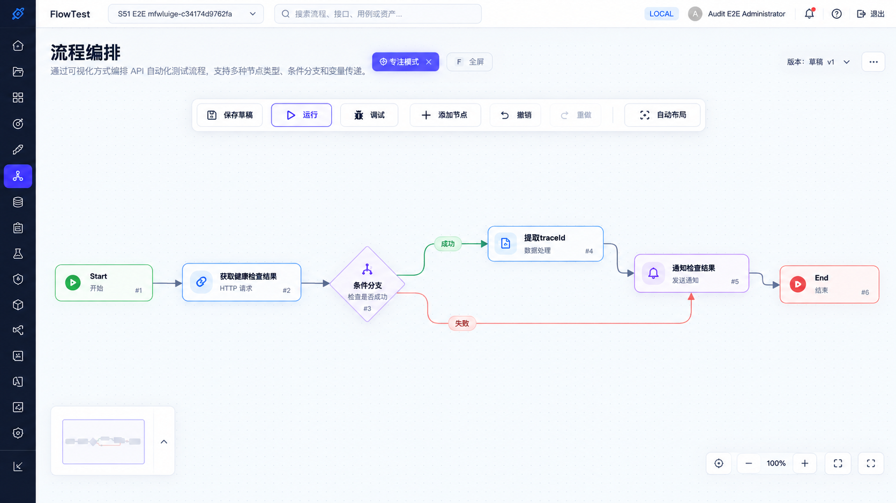
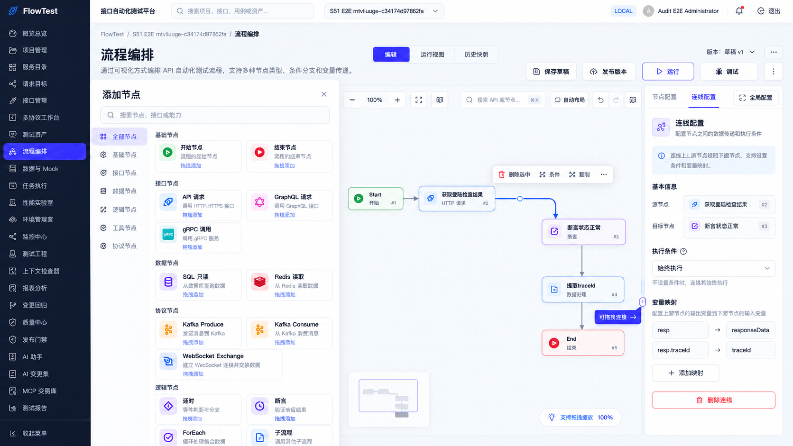
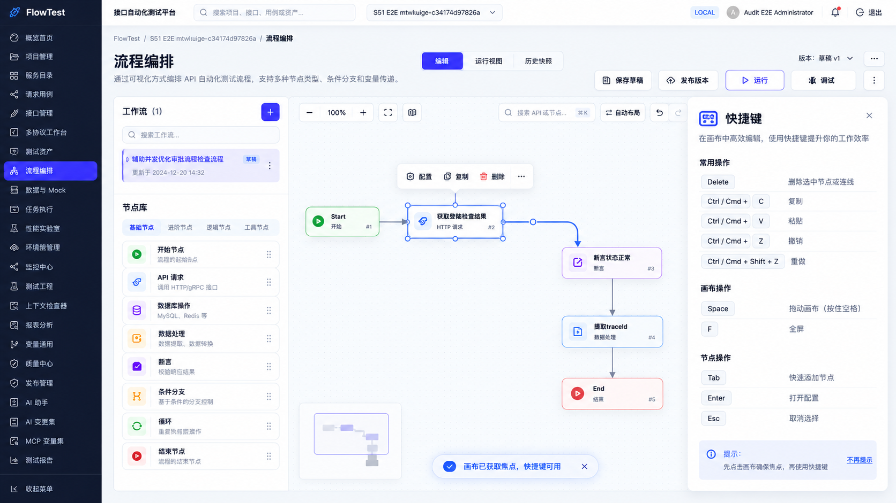
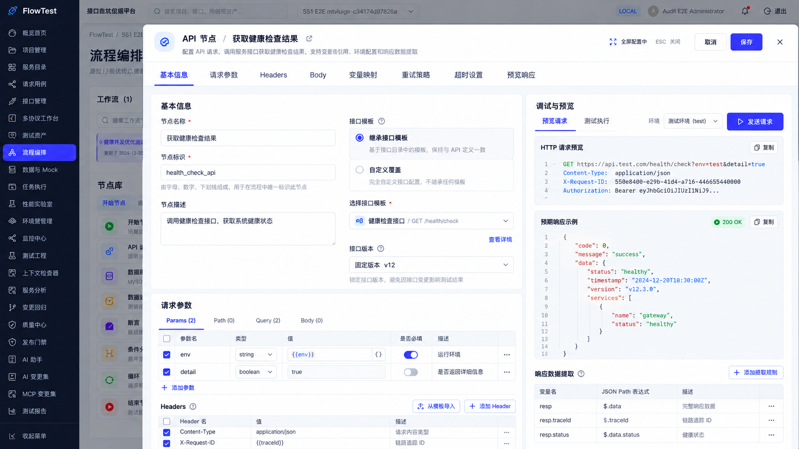
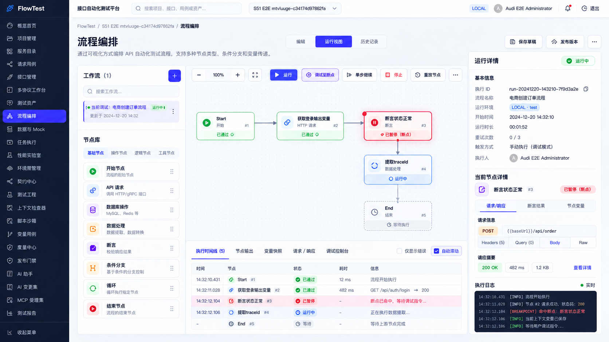
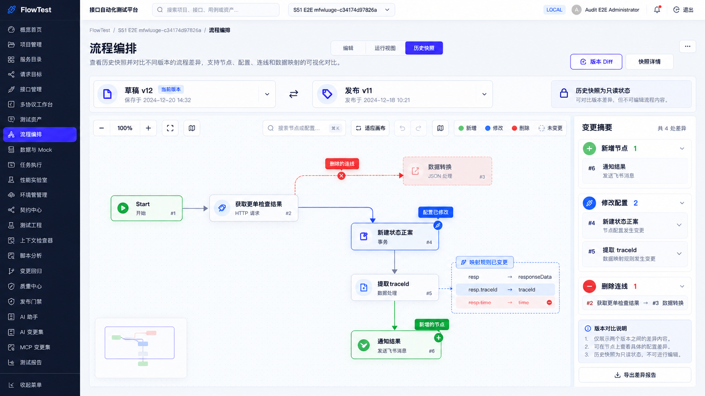

# FlowTest 流程编排专项优化方案｜开发落地版

> 适用对象：前端开发、后端开发、测试、Codex / AI 编码执行。  
> 目标：将产品方案落成可执行的组件改造、状态模型、交互逻辑、测试用例与迭代任务清单。

---

## 1. 改造原则

1. **优先兼容现有 WorkflowDefinition 数据结构**，UI 结构先改，避免无必要的大规模后端协议变更。
2. **WorkflowDesigner 继续作为核心画布容器，但逐步拆分职责**。
3. **节点与连线统一为 Selection 模型**。
4. **快捷键只在画布焦点范围内生效**。
5. **不允许输入控件触发画布级 Delete / Tab / Copy 等行为**。
6. **Undo / Redo 必须覆盖节点移动、节点删除、连线删除、节点新增、粘贴、自动布局等定义变更**。
7. **运行 / 历史模式严格只读**，除非明确支持调试动作。

---

## 2. 现有关键代码位置

重点改造文件：

```text
frontend/src/pages/WorkflowsPage.tsx
frontend/src/flow/WorkflowDesigner.tsx
frontend/src/flow/WorkflowNodeInspector.tsx
frontend/src/flow/WorkflowApiRequestEditor.tsx
frontend/src/flow/WorkflowDesigner.test.tsx
frontend/src/flow/workflow-graph.ts
frontend/src/styles.css
```

建议新增：

```text
frontend/src/flow/WorkflowCanvas.tsx
frontend/src/flow/WorkflowToolbar.tsx
frontend/src/flow/WorkflowSelectionToolbar.tsx
frontend/src/flow/WorkflowEdgeInspector.tsx
frontend/src/flow/WorkflowNodeLibrary.tsx
frontend/src/flow/WorkflowShortcutHelp.tsx
frontend/src/flow/WorkflowFullscreenEditor.tsx
frontend/src/flow/hooks/useCanvasHotkeys.ts
frontend/src/flow/hooks/useWorkflowSelection.ts
frontend/src/flow/hooks/useWorkflowHistory.ts
frontend/src/flow/hooks/useResizableInspector.ts
```

---

## 3. Selection 模型重构

建议当前 `selectedId` 升级为：

```ts
type WorkflowSelection =
  | { type: 'node'; id: string }
  | { type: 'edge'; id: string }
  | null
```

作用：

- 节点和连线统一管理；
- Delete 等快捷键不再区分入口；
- Inspector 根据 selection 自动切换；
- 浮动操作条逻辑统一。

新增 helper：

```ts
function selectedNode(definition, selection)
function selectedEdge(definition, selection)
function deleteSelection(definition, selection)
```

---

## 4. 连线选择与删除

### 4.1 React Flow 事件

在 `WorkflowDesigner` / 新的 `WorkflowCanvas` 中接入：

```tsx
onEdgeClick={(_, edge) => setSelection({ type: 'edge', id: edge.id })}
onNodeClick={(_, node) => setSelection({ type: 'node', id: node.id })}
onPaneClick={() => setSelection(null)}
```

### 4.2 Edge 视觉状态

`toCanvasEdge` 增加：

- selected style
- hover style
- label chip
- optional condition marker

建议：

```ts
style: selected
  ? { stroke: '#4f46e5', strokeWidth: 3 }
  : defaultStyle
```

### 4.3 删除 Edge

新增：

```ts
export function removeEdge(
  definition: WorkflowDefinition,
  edgeId: string,
): WorkflowDefinition {
  return {
    ...definition,
    edges: definition.edges.filter((edge) => edge.id !== edgeId),
  }
}
```

删除流程：

1. 选中 edge；
2. Delete / Toolbar / Inspector 发起删除；
3. 判断该 edge 是否包含 condition / mappings；
4. 有附加配置时弹确认；
5. applyChange(removeEdge(...))；
6. clearSelection();
7. history 自动记录。

---

## 5. Edge Inspector

新增：

```text
WorkflowEdgeInspector.tsx
```

Props：

```ts
type EdgeInspectorProps = {
  edge: WorkflowEdge
  definition: WorkflowDefinition
  editable: boolean
  onChange(next: WorkflowDefinition): void
  onDelete(): void
}
```

配置项：

- 源节点（只读）
- 目标节点（只读）
- 条件类型
- 条件表达式
- 连线标签
- 变量映射
- 危险区：删除连线

---

## 6. 右侧 Inspector 可调宽

### 6.1 布局

将：

```css
grid-template-columns: minmax(540px, 1fr) 420px;
```

改为状态驱动：

```tsx
style={{ gridTemplateColumns: `minmax(540px, 1fr) ${inspectorWidth}px` }}
```

### 6.2 Drag Gutter

增加 `ResizeHandle`：

```text
Canvas | 6px ResizeHandle | Inspector
```

限制：

- min: 320
- default: 420
- max: min(760, viewport * 0.55)

### 6.3 持久化

```ts
localStorage.setItem('flowtest.workflow.inspectorWidth', String(width))
```

---

## 7. 画布高度自适应

不再使用固定 `height: 540px`。

建议：

```css
.workflow-page {
  height: calc(100vh - var(--app-header-height));
}

.workflow-designer-body {
  min-height: 0;
  height: 100%;
}

.workflow-canvas {
  min-height: 0;
  height: 100%;
}
```

WorkflowsPage 中工作区 Card 也需避免固定内容高度。

---

## 8. 专注模式 / 全屏模式

状态：

```ts
const [focusMode, setFocusMode] = useState(false)
const [canvasFullscreen, setCanvasFullscreen] = useState(false)
```

Focus Mode：

- 收起 WorkflowListPanel
- 收起 Inspector
- Canvas 占满内容区域

Canvas Fullscreen：

- 使用 Fullscreen API（若浏览器支持）
- 或使用 fixed overlay fallback

快捷键：

```text
F => toggle fullscreen
Esc => exit fullscreen / clear selection
```

---

## 9. 节点库重构

将 `DesignerToolbar` 中大量节点创建按钮迁移到：

```text
WorkflowNodeLibrary.tsx
```

### 9.1 数据驱动定义

```ts
type NodeCatalogItem = {
  type: string
  category: 'basic' | 'api' | 'data' | 'logic' | 'protocol' | 'tool'
  title: string
  description: string
  icon: ReactNode
  disabled?: boolean
  requires?: string[]
}
```

### 9.2 支持

- 搜索
- 分类
- 点击添加
- 拖拽添加

### 9.3 添加逻辑

复用已有：

- `addApiNode`
- `addProtocolNode`
- `addEventProtocolNode`
- `addTypedNode`

不要复制业务逻辑到 UI。

---

## 10. 快捷键系统

新增：

```text
useCanvasHotkeys.ts
```

输入：

```ts
type HotkeyContext = {
  enabled: boolean
  selection: WorkflowSelection
  canEdit: boolean
  deleteSelection(): void
  copy(): void
  paste(): void
  undo(): void
  redo(): void
  openInspector(): void
  openAddNode(): void
  toggleFullscreen(): void
  clearSelection(): void
}
```

### 10.1 关键保护

```ts
function isEditableTarget(target: EventTarget | null) {
  return target instanceof HTMLElement && (
    target.matches('input, textarea, [contenteditable="true"]') ||
    Boolean(target.closest('.ant-select, .ant-input, .monaco-editor'))
  )
}
```

在输入场景中，不响应画布删除等快捷键。

### 10.2 快捷键

```text
Delete / Backspace -> deleteSelection
Meta/Ctrl + C -> copy
Meta/Ctrl + V -> paste
Meta/Ctrl + Z -> undo
Meta/Ctrl + Shift + Z -> redo
Enter -> openInspector
Tab -> openAddNode
F -> toggleFullscreen
Esc -> clearSelection / exit
Space -> pan mode
```

---

## 11. 历史栈重构建议

当前已有 `history.past / history.future`，建议抽成：

```text
useWorkflowHistory.ts
```

API：

```ts
apply(nextDefinition)
undo()
redo()
canUndo
canRedo
reset(definition)
```

注意：

- 不记录无变化 definition；
- 拖拽节点时避免每个 pointer move 都入栈；
- 推荐 drag end 再提交完整位置变更。

---

## 12. 节点全屏配置

### 12.1 现状复用

`WorkflowApiRequestEditor.tsx` 已具备：

- Drawer
- 请求模板
- Params
- Headers
- Body
- Preview

### 12.2 改造建议

拆为：

```text
WorkflowApiRequestEditor
├─ QuickSummary
├─ FullscreenRequestEditor
├─ RequestTabs
├─ RequestPreviewPane
└─ ResponseExtractionPanel
```

### 12.3 全屏布局

左 65%：配置表单
右 35%：请求预览 / 测试响应

顶部固定：

- 节点名称
- 保存
- 取消
- ESC 关闭

---

## 13. 运行与调试

当前已有 `WorkflowRunInspector`，建议保留核心数据逻辑，重构布局。

新增页面区块：

```text
RunToolbar
ExecutionTimeline
CurrentNodePanel
ExecutionLogs
```

节点状态映射：

```text
pending  -> 灰色
running  -> 蓝色
passed   -> 绿色
failed   -> 红色
skipped  -> 灰紫
paused   -> 红/橙（调试断点）
```

---

## 14. 历史 Diff

建议差异结构统一：

```ts
type DiffStatus = 'added' | 'modified' | 'removed' | 'unchanged'
```

Node / Edge 都支持：

```ts
proposalNodeStatuses
proposalEdgeStatuses
```

UI 增加：

- Legend
- 右侧 Change Summary
- 点击差异项定位画布元素
- 映射差异结构化展示

---

## 15. 测试计划

## 15.1 WorkflowDesigner.test.tsx 新增

### Edge

- edge click selects edge
- selected edge opens edge inspector
- delete selected edge updates definition
- delete edge with mappings asks for confirm
- undo restores deleted edge
- redo removes again

### Keyboard

- Delete removes selected node
- Delete removes selected edge
- Delete ignored inside input
- Cmd/Ctrl+C copies node
- Cmd/Ctrl+V pastes node
- Cmd/Ctrl+Z undo
- Cmd/Ctrl+Shift+Z redo
- Enter opens inspector
- Esc clears selection

### Inspector resize

- drag changes width
- width clamped to min/max
- width restored from localStorage

### Focus mode

- left/right panels hidden
- canvas remains usable

### Fullscreen node editor

- opens from inspector
- ESC closes
- save persists node definition

---

## 15.2 E2E 建议

Playwright 场景：

```text
1. 创建工作流
2. 添加 API 节点
3. 拖出连线
4. 选中连线
5. 设置映射
6. Delete 删除
7. Undo 恢复
8. 打开 API 全屏配置
9. 修改请求参数
10. 保存
11. 运行流程
12. 查看执行时间线
```

---

## 16. 实施任务拆分

### Phase 1：基础交互（P0）

- [ ] Selection 模型统一
- [ ] onEdgeClick
- [ ] EdgeInspector
- [ ] removeEdge
- [ ] Delete shortcut
- [ ] Copy/Paste shortcut
- [ ] Undo/Redo shortcut
- [ ] Inspector resize
- [ ] Canvas auto height
- [ ] Toolbar 瘦身

### Phase 2：编辑体验（P1）

- [ ] Node Library Drawer
- [ ] Node 搜索
- [ ] Drag add node
- [ ] Focus mode
- [ ] Canvas fullscreen
- [ ] Fullscreen node editor
- [ ] Shortcut help

### Phase 3：运行与差异（P1/P2）

- [ ] Run toolbar
- [ ] Timeline
- [ ] Debug breakpoint UI
- [ ] Version Diff summary
- [ ] Mapping diff

---

## 17. 兼容性要求

1. 不改变已有 WorkflowDefinition schema，除非 Edge 配置确实缺失字段；
2. 旧草稿必须可继续打开；
3. 旧发布版本必须可继续查看；
4. 运行中的 workflow 继续锁定编辑；
5. proposal / history 模式继续只读；
6. 节点类型能力不减少，只调整入口层级。

---

## 18. UI 验收稿

### 主编排



### 节点库



### 快捷键



### 节点全屏配置



### 连线管理


### 调试运行



### 版本 Diff



---

## 19. 建议 Codex 执行顺序

1. 先只读审计 `WorkflowDesigner`、`workflow-graph.ts`、`WorkflowNodeInspector` 与相关测试；
2. 先实现 selection + edge delete；
3. 再实现快捷键；
4. 再做布局 / resize；
5. 再拆 toolbar / node library；
6. 最后做 fullscreen editor、run/debug、diff。

每个阶段都要求：

- 先补测试；
- 再实现；
- 不改无关代码；
- 保持现有数据模型兼容；
- 提交前执行前端 lint / unit test / e2e 对应子集。
